# Friday AI Assistant – System Architecture Specification

## 1. Architectural Overview

**Friday AI Assistant** is a fully local, high-performance personal AI desktop assistant built strictly according to **Clean Architecture** principles.

The codebase enforces unidirectional inward dependency flow:


Presentation Layer (PySide6 UI)
       ↓
Tool Execution Engine & AI Services
       ↓
Voice & Activation Subsystem (ClapDetector, AudioEngine, DeviceManager, RingBuffer, Streams)
       ↓
Browser & Windows Tools Layer (Browser Tools, Filesystem, Process, Audio, Power)
       ↓
Browser Engine & URL Security Subsystem (UrlSecurityManager, BrowserService, PlaywrightController)
       ↓
Tool Registry & Command Foundation (ToolRegistry, ToolDiscoveryService, BaseTool)
       ↓
Application Services & Events Engine (ServiceManager, EventBus)
       ↓
Windows Platform Integration Layer (app/platform/)
       ↓
Core Domain & Configuration (Models, Interfaces, Settings, Identity)
       ↓
Infrastructure Layer (sounddevice, FileSystem, OS, winreg, Playwright, psutil, APScheduler)
```

Business logic is completely isolated from UI elements, direct shell calls, and platform-specific APIs, making every subsystem independently testable and modular.

---

## 2. Layer Definitions & Module Relationships

```mermaid
flowchart TD
    UI[Presentation Layer: PySide6 GUI] --> Exec[Tool Execution Engine: ToolExecutor]
    UI --> ClapDet[Phase 3.2: ClapDetector Subsystem]
    UI --> AudioEng[Phase 3.1: AudioEngine Subsystem]
    Exec --> Security[Security & Authorization Provider]
    Exec --> ToolReg[Tool Registry]
    ToolReg --> WinTools[Core Windows, Filesystem & Browser Tools]
    WinTools --> BServ[Browser Engine: BrowserService]
    BServ --> UrlSec[UrlSecurityManager & PlaywrightController]
    BServ --> Services[Application Services Engine]
    ClapDet --> AudioEng
    ClapDet --> Services
    AudioEng --> Services
    Services --> Platform[Windows Platform Layer]
    Services --> Core[Core Domain & Configuration]
    Platform --> Infra[OS / sounddevice / Playwright / Win32 / Shell / psutil APIs]

    subgraph Support Infrastructure
        Logging[app/logging/]
        Crash[app/crash/]
        Monitoring[app/monitoring/]
        Diagnostics[app/diagnostics/]
        AudioSubsystem[app/voice/audio/]
        ClapSubsystem[app/voice/clap/]
        Plugins[app/plugins/]
        Build[app/build/]
        Exec
    end

    Services --> Support Infrastructure
```

---

## 3. Phase 3 Voice Architecture (Phases 3.1 & 3.2 Implemented)

### 3.1 Double-Clap Activation Architecture (Section 70)

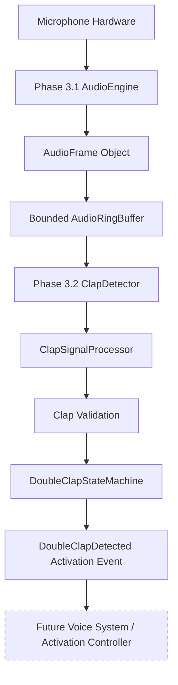

### 3.2 Double-Clap State Machine Diagram (Section 71)

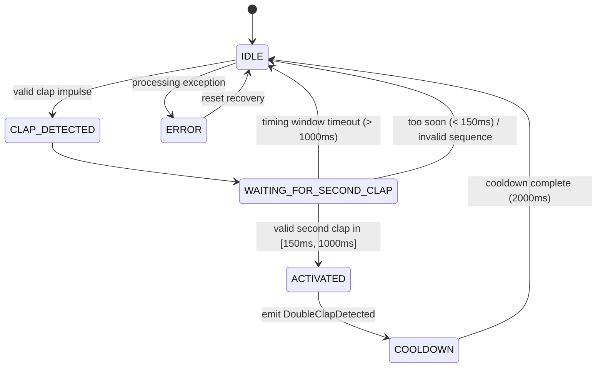

### 3.3 Clap Signal Processing Flow Diagram (Section 72)

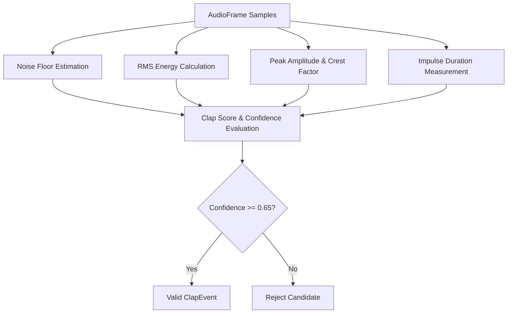


### 3.4 Phase 3.3 Wake Word Subsystem Architecture

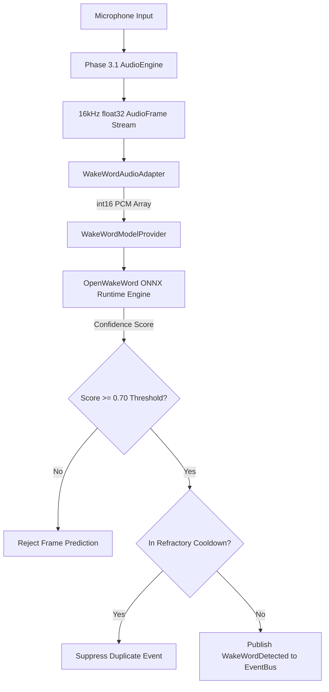

### 3.5 Phase 3.3 Dual Alternative Activation Model

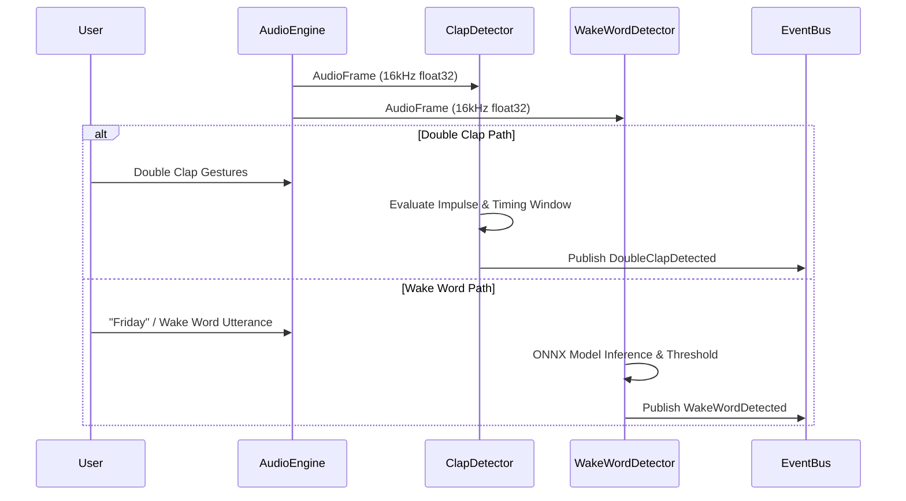

### 3.6 Phase 3.3 Wake Word Detector State Machine

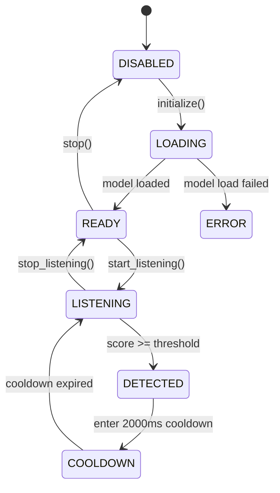

### 3.7 Phase 3.4 — Voice Activity Detection & Speech Boundary Architecture

#### VAD Data Flow Diagram
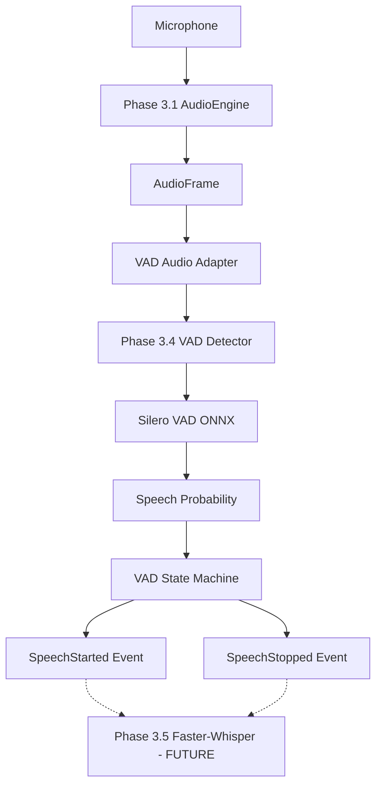

#### Three-Way Audio Engine Consumer Architecture Diagram
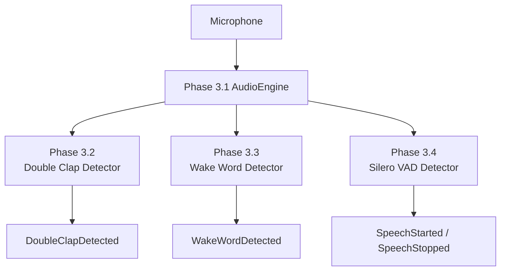

#### VAD State Machine Transition Diagram
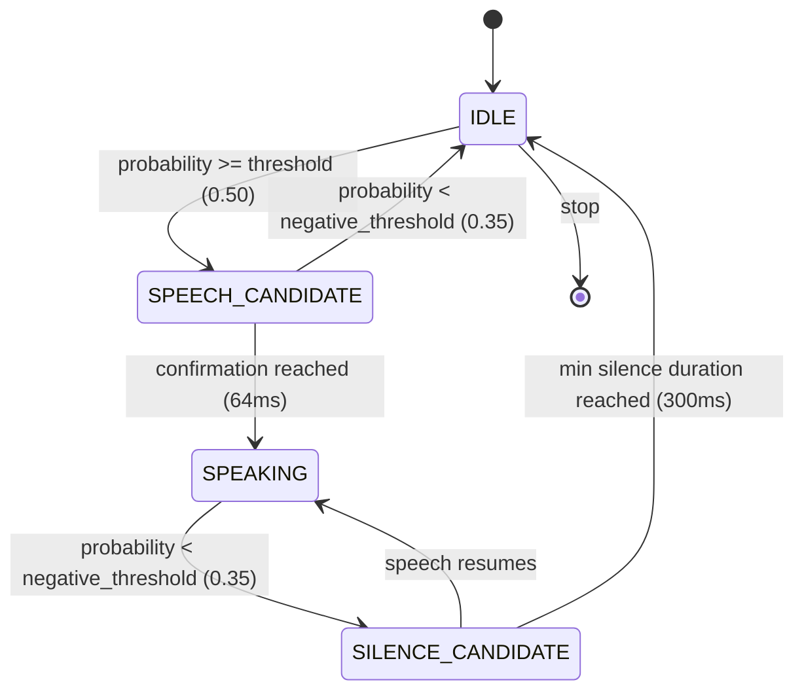

```

### 3.8 Phase 3.5 — Speech-to-Text (STT) Architecture

#### STT Data Flow Diagram
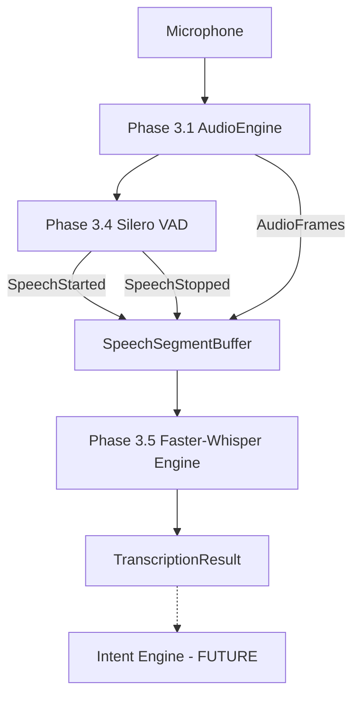

#### Four-Way Audio Engine Consumer Architecture Diagram
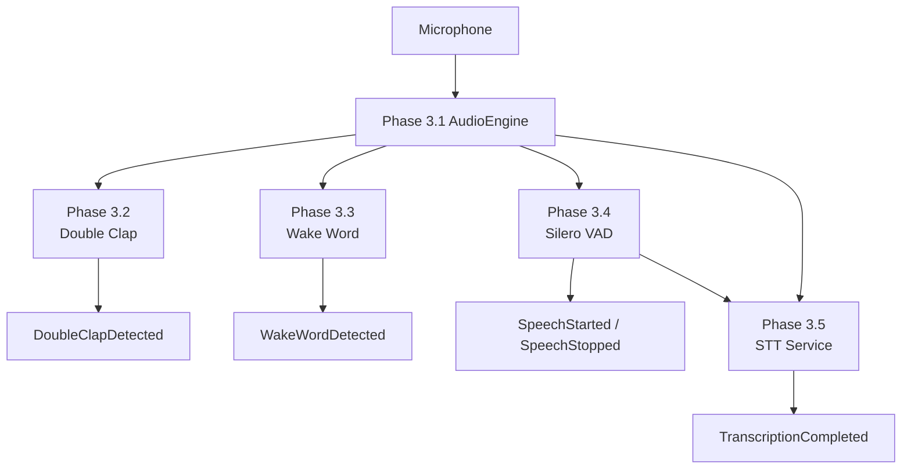

#### STT State Machine Transition Diagram
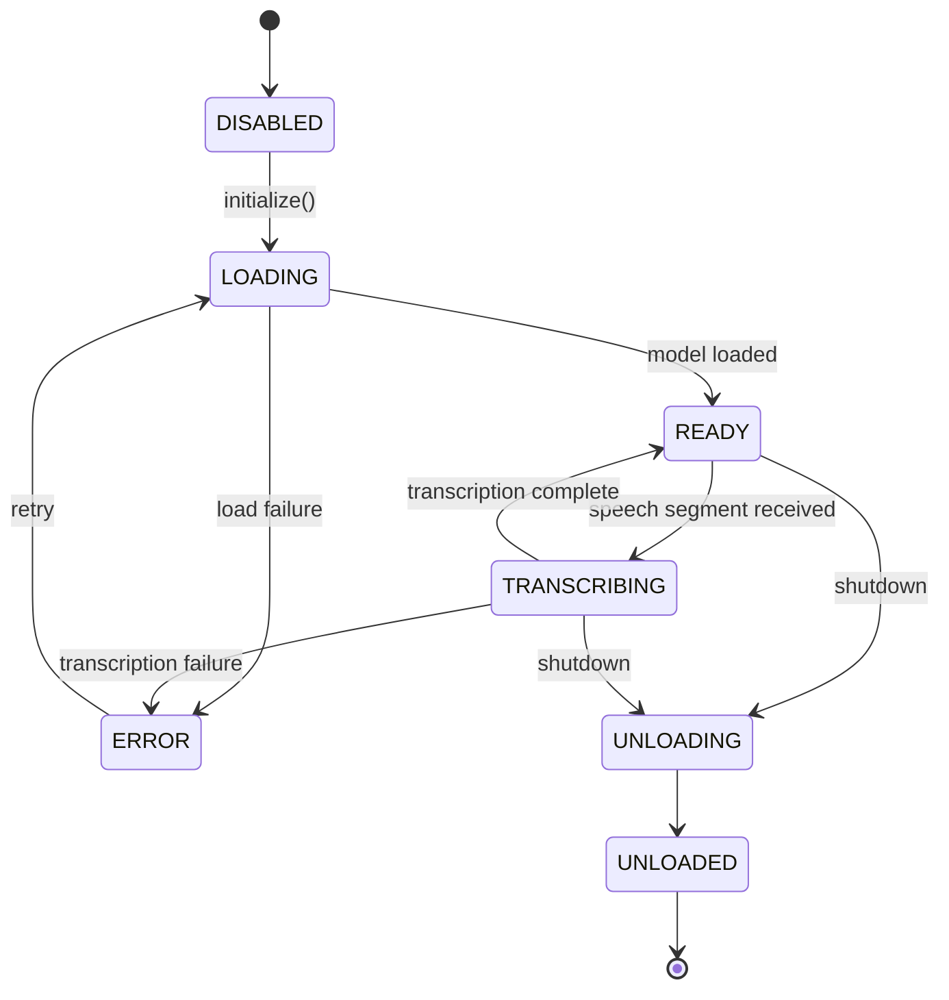

### 3.9 Phase 3.6 — Piper Text-to-Speech (TTS) Architecture

#### TTS Data Flow Diagram
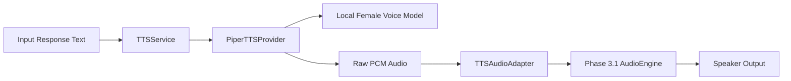

#### TTS Sentence Chunking & Queue Flow Diagram
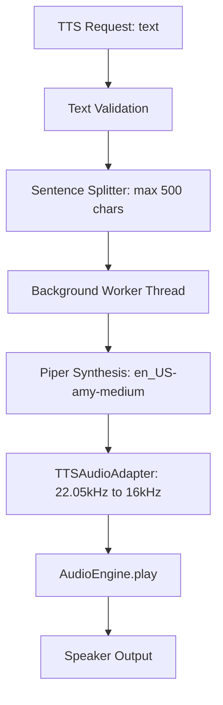

#### TTS State Machine Transition Diagram
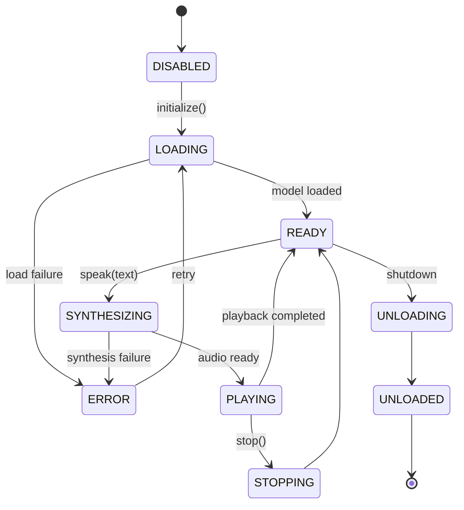

### 3.10 Phase 3.7 — Conversation State Machine & Real-Time Voice Orchestration Architecture

#### Conversation State Machine Transition Diagram
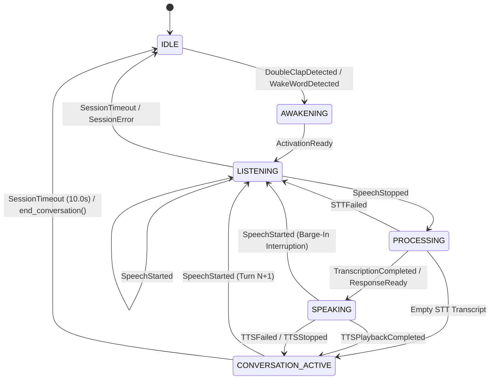

#### Barge-In Speech Interruption Flow Diagram
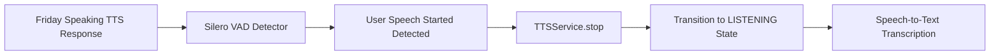

#### Conversation Session Lifecycle Diagram
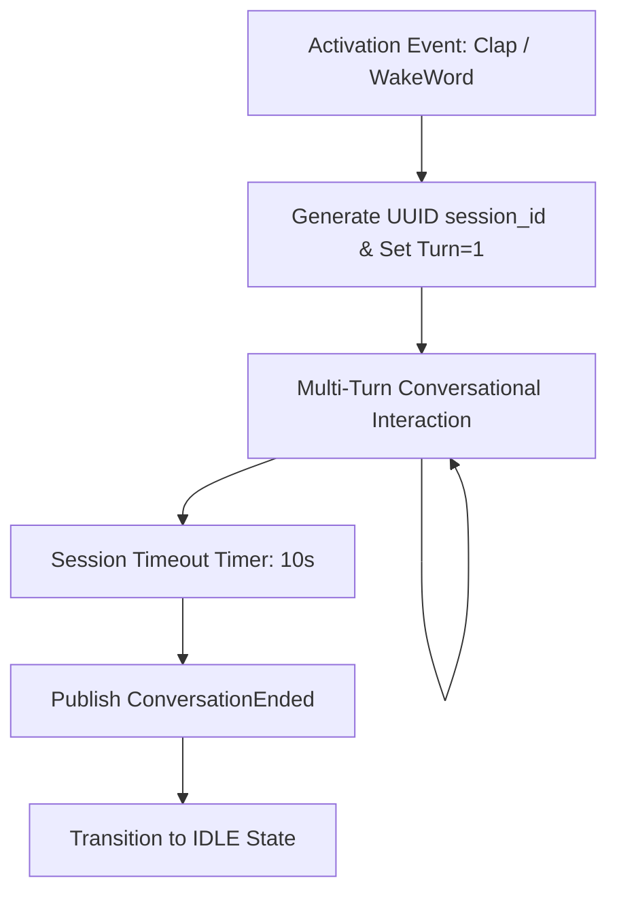

#### Full Subsystem Voice Orchestration Diagram
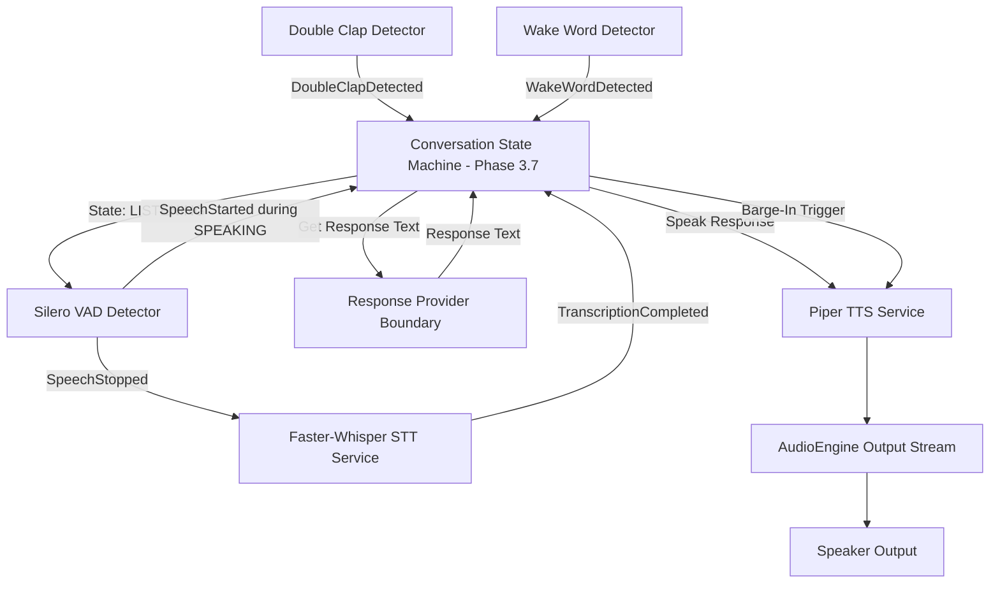

### 3.11 Phase 3.8 — Conversation Manager & Short-Term Memory Architecture

#### Conversation Manager Context Data Flow Diagram
```mermaid
flowchart TD
    TRANSCRIPT[User Speech Transcript]
    MGR[Phase 3.8 Conversation Manager]
    STORE[InMemConversationStore]
    REF[Deterministic Reference Resolver]
    BUILDER[ContextBuilder & Sanitizer]
    SNAPSHOT[ContextSnapshot]
    INTENT[Intent Engine / AI Provider]
    EXEC[Phase 2 ToolExecutor]
    RESULT[Tool Result]
    RESP[ManagerResponseProvider]
    STATE[Phase 3.7 Conversation State Machine]

    TRANSCRIPT --> MGR
    MGR --> STORE
    MGR --> REF
    REF -->|Resolved Entity / Ambiguity| MGR
    MGR --> BUILDER
    BUILDER --> SNAPSHOT
    SNAPSHOT --> INTENT
    INTENT --> EXEC
    EXEC --> RESULT
    RESULT --> MGR
    MGR --> RESP
    RESP --> STATE
```

#### Reference Resolution Flowchart Diagram
```mermaid
flowchart TD
    INPUT[User Request text]
    DETECT[Detect Reference Keyword e.g. 'it', 'the file']
    CHECK{Reference Keyword Found?}
    NO_REF[Proceed without Reference Resolution]
    SEARCH[Search Active Entities in Session Store]
    MATCH{Entities Found?}
    NOT_FOUND[Return ReferenceResolutionStatus.NOT_FOUND]
    AMBIGUOUS_CHECK{Multiple Candidates with Equal Recency?}
    AMBIGUOUS[Return ReferenceResolutionStatus.AMBIGUOUS & Trigger Clarification]
    RESOLVE[Return ReferenceResolutionStatus.RESOLVED & Target Entity]

    INPUT --> DETECT
    DETECT --> CHECK
    CHECK -->|NO| NO_REF
    CHECK -->|YES| SEARCH
    SEARCH --> MATCH
    MATCH -->|NO| NOT_FOUND
    MATCH -->|YES| AMBIGUOUS_CHECK
    AMBIGUOUS_CHECK -->|YES| AMBIGUOUS
    AMBIGUOUS_CHECK -->|NO| RESOLVE
```

#### Session Lifecycle & Short-Term Memory Diagram
```mermaid
flowchart TD
    ACTIVATE[Phase 3.7 Activation Event]
    START[start_session: session_id UUID]
    STORE[In-Memory Session Context Container]
    TURNS[Add User & Assistant Conversation Turns]
    ENTITIES[Track Application, File & Website Entities]
    SANATIVE[Apply SensitiveDataSanitizer]
    END[end_session / SessionTimeout]
    FLUSH[Flush & Delete In-Memory Session Context Container]

    ACTIVATE --> START
    START --> STORE
    STORE --> TURNS
    STORE --> ENTITIES
    TURNS --> SANATIVE
    ENTITIES --> SANATIVE
    SANATIVE --> END
    END --> FLUSH
```

### 3.13 Phase 3.9 — Natural Greetings Foundation Architecture

#### Natural Greetings Subsystem Data Flow Diagram
```mermaid
flowchart TD
    CLAP[Phase 3.2 Double Clap] --> ACTIVATE[ConversationActivated Event]
    WAKE[Phase 3.3 Wake Word] --> ACTIVATE
    ACTIVATE --> STATE[Phase 3.7 Conversation State Machine]
    STATE --> MGR[Phase 3.8 Conversation Manager]
    ACTIVATE --> BUILDER[GreetingContextBuilder]
    MGR -->|Context Snapshot| BUILDER
    BUILDER -->|GreetingContext| SVC[GreetingService]
    SVC --> SELECTOR[GreetingSelector]
    SELECTOR --> PROVIDER[IGreetingProvider Interface]
    PROVIDER --> TEMPLATE[TemplateGreetingProvider]
    TEMPLATE -->|GreetingResponse| SVC
    SVC -->|Response Text| TTS[Phase 3.6 Piper TTSService]
    TTS --> AUDIO[Phase 3.1 AudioEngine Speaker]
```

#### Context-Aware Greeting Selection Flowchart Diagram
```mermaid
flowchart TD
    ACTIVATION[Activation Trigger: Double Clap / Wake Word]
    BUILD_CTX[Retrieve Session & Hour Context]
    CHECK_TIME{Hour of Day?}
    MORNING[Category: MORNING]
    AFTERNOON[Category: AFTERNOON]
    EVENING[Category: EVENING]
    NIGHT[Category: NIGHT]
    CHECK_RET{Is Returning Session?}
    RETURNING[Category: RETURNING]
    FILTER[Filter Candidates Against Recent History Buffer]
    SELECT[Select Greeting Template & Personalize]
    DISPATCH[Dispatch Text to TTSService.speak]

    ACTIVATION --> BUILD_CTX
    BUILD_CTX --> CHECK_RET
    CHECK_RET -->|YES| RETURNING
    CHECK_RET -->|NO| CHECK_TIME
    CHECK_TIME -->|05:00 - 11:59| MORNING
    CHECK_TIME -->|12:00 - 16:59| AFTERNOON
    CHECK_TIME -->|17:00 - 21:59| EVENING
    CHECK_TIME -->|22:00 - 04:59| NIGHT
    MORNING --> FILTER
    AFTERNOON --> FILTER
    EVENING --> FILTER
    NIGHT --> FILTER
    RETURNING --> FILTER
    FILTER --> SELECT
    SELECT --> DISPATCH
```

#### Future AI Provider Abstraction Boundary Diagram
```mermaid
flowchart TD
    SVC[GreetingService]
    INTERFACE[IGreetingProvider Abstract Interface Contract]
    TEMPLATE[TemplateGreetingProvider\nLocal / Deterministic\nPhase 3.9]
    FUTURE_AI[AIGreetingProvider\nCloud / LLM / Personality\nFuture Phase 4]

    SVC --> INTERFACE
    INTERFACE --> TEMPLATE
    INTERFACE -.-> FUTURE_AI
```

### 3.14 Full Phase 3 Master Architecture Diagram

```mermaid
flowchart TD
    User([User Speech / Ambient Audio]) --> Microphone[Microphone]
    Microphone --> AudioEngine[Phase 3.1 Audio Engine: sounddevice]
    
    subgraph Phase 3.1 Audio Engine Foundation
        AudioEngine --> InputStr[AudioInputStream & RingBuffer]
        AudioEngine --> OutputStr[AudioOutputStream & Speaker]
    end

    subgraph Four Parallel Local Audio Input Consumers
        InputStr -->|AudioFrame Stream| Clap[Phase 3.2 Clap Detection & Activation]
        InputStr -->|AudioFrame Stream| Wake[Phase 3.3 OpenWakeWord Detection]
        InputStr -->|AudioFrame Stream| VAD[Phase 3.4 Silero VAD Detector]
        InputStr -->|AudioFrame Stream| STT[Phase 3.5 Faster-Whisper STT Service]
    end

    Clap -->|DoubleClapDetected| ConvState[Phase 3.7 Conversation State Machine]
    Wake -->|WakeWordDetected| ConvState
    VAD -->|SpeechStarted / SpeechStopped| STT
    VAD -->|Barge-In SpeechStarted| ConvState
    
    STT -->|TranscriptionCompleted| ConvMgr[Phase 3.8 Conversation Manager]
    
    ConvState -->|ConversationActivated| GreetSvc[Phase 3.9 GreetingService]
    GreetSvc -->|GreetingResponse| TTS[Phase 3.6 Piper TTS Service]
    
    ConvMgr -->|ContextSnapshot| Intent[Intent Engine / AI Layer]
    Intent --> ToolExec[Phase 2 ToolExecutor Engine]
    ToolExec -->|ToolResult| ConvMgr
    
    ConvMgr -->|ManagerResponseProvider| ConvState
    ConvState -->|Response Text| TTS
    TTS -->|16kHz PCM Audio| OutputStr
    OutputStr --> Speaker[Speaker / Headphone Output]
### 3.15 Phase 4.1 — Local LLM Runtime & Model Provider Architecture

#### Phase 4.1 AI Provider Abstraction Diagram
```mermaid
flowchart TD
    APP[Friday Application / Gateway] --> MGR[LLMModelManager Gateway Service]
    MGR --> INTERFACE[IAIModelProvider Abstract Interface]
    INTERFACE --> LLAMA[LlamaCppProvider\nllama.cpp GGUF Runtime]
    INTERFACE --> OLLAMA[OllamaProvider\nLocal Ollama REST API]
    INTERFACE --> FAKE[FakeAIModelProvider\nDeterministic Test Double]
    LLAMA --> GGUF[Local GGUF Model File]
    OLLAMA --> OLLAMA_SRV[Local Ollama Service: 11434]
```

#### Model Lifecycle State Machine Diagram
```mermaid
flowchart TD
    UNINIT[UNINITIALIZED] -->|load_model| LOADING[LOADING]
    LOADING -->|Success| READY[READY]
    LOADING -->|Failure| ERROR[ERROR]
    READY -->|generate| GENERATING[GENERATING]
    GENERATING -->|Complete / Error| READY
    READY -->|unload_model| UNLOADING[UNLOADING]
    UNLOADING --> UNINIT
    ERROR -->|load_model| LOADING
```

#### Master Phase 4 AI Brain Integration Architecture Diagram
```mermaid
flowchart TD
    CONV[Phase 3 Voice / Conversation Manager] -->|AIRequest| MGR[Phase 4.1 LLMModelManager]
    MGR --> PROVIDER[IAIModelProvider Interface]
    PROVIDER --> LLAMA[LlamaCppProvider]
    PROVIDER --> OLLAMA[OllamaProvider]
    LLAMA --> GGUF[Local GGUF Model]
    OLLAMA --> OLLAMA_SRV[Ollama REST API]
    MGR -->|AIResponse| CONV
### 3.16 Phase 4.2 — AI Orchestrator & Reasoning Workflow Architecture

#### AI Orchestrator Reasoning Pipeline Diagram
```mermaid
flowchart TD
    REQ[OrchestrationRequest] --> ORCH[AIOrchestrator Service]
    ORCH --> TOOLS[ToolRegistry\nList Registered Tools]
    ORCH --> LLM[LLMModelManager\nGenerate Response]
    LLM --> DECISION{Response Type?}
    DECISION -->|Text Response| SYNTH[Synthesize Final Text]
    DECISION -->|Tool Call| VAL[Validate Tool Name & Args]
    VAL --> EXEC[Phase 2 ToolExecutor\nExecute Tool Request]
    EXEC --> RESULT[ToolResult Summary]
    RESULT --> LOOP[Feed Tool Result Back to LLM]
    LOOP --> LLM
    SYNTH --> OUT[OrchestrationResult]
```

#### AI Orchestrator State Machine Diagram
```mermaid
flowchart TD
    IDLE[IDLE] -->|process_request| ANALYZING[ANALYZING]
    ANALYZING --> PLANNING[PLANNING]
    PLANNING -->|Tool Requested| EXECUTING[EXECUTING_TOOLS]
    EXECUTING -->|Tool Result Returned| PLANNING
    PLANNING -->|Text Completed| SYNTH[SYNTHESIZING]
    SYNTH --> COMPLETED[COMPLETED]
    ANALYZING -->|Error| FAILED[FAILED]
    PLANNING -->|Error| FAILED
    EXECUTING -->|Error| FAILED
    COMPLETED --> IDLE
    FAILED --> IDLE
### 3.17 Phase 4.3 — Tool Calling & Function Binding Architecture

#### Tool Calling Architecture Diagram
```mermaid
flowchart TD
    LLM[Local LLM Runtime Phase 4.1] --> ADAPTER[DefaultToolCallAdapter\nVendor Wire Format Normalizer]
    ADAPTER --> CANONICAL[Canonical ToolCall Model]
    CANONICAL --> ENGINE[ToolCallingEngine Service]
    ENGINE --> SCHEMA[ToolSchemaRegistry\nDynamic Schema & Cache]
    ENGINE --> VALIDATOR[Argument & Type Validator]
    VALIDATOR --> REQ[ToolRequest Model]
    REQ --> EXEC[Phase 2 ToolExecutor Engine]
    EXEC --> REAL_TOOL[Registered BaseTool Instance]
    REAL_TOOL --> RESULT[ToolResult Model]
    RESULT --> SANITIZER[SensitiveDataSanitizer & Output Truncator]
    SANITIZER --> ISOLATION[Prompt Injection Isolation\nTOOL_RESULT Tags]
    ISOLATION --> ORCH[Phase 4.2 AIOrchestrator]
```

#### Tool Calling Execution Sequence Diagram
```mermaid
sequenceDiagram
    participant LLM as Local LLM
    participant Adapter as ToolCallAdapter
    participant Engine as ToolCallingEngine
    participant Validator as InputValidator
    participant Executor as ToolExecutor (Phase 2)
    participant Tool as BaseTool
    participant Sanitizer as SensitiveDataSanitizer

    LLM->>Adapter: Raw JSON / Wire Output
    Adapter->>Engine: Canonical ToolCall(tool_name, args)
    Engine->>Validator: validate_input(args)
    alt Invalid Tool or Args
        Validator-->>Engine: Validation Error (UNKNOWN_TOOL / INVALID_ARGUMENTS)
        Engine-->>LLM: Rejection Output
    else Valid Tool & Args
        Validator-->>Engine: Validation Success
        Engine->>Executor: execute(tool_id, arguments)
        Executor->>Tool: _execute(arguments)
        Tool-->>Executor: ToolResult
        Executor-->>Engine: ToolResult
        Engine->>Sanitizer: sanitize_dict(result)
        Sanitizer-->>Engine: Sanitized Output & Truncated Text
        Engine-->>LLM: TOOL_RESULT Tag Output
    end
### 3.18 Phase 4.4 — Personality Engine & Behavioral Identity Architecture

#### Personality Engine Architecture Diagram
```mermaid
flowchart TD
    SET[FridayPersonalitySettings] --> PROFILE[PersonalityProfile\nIdentity + CommStyle + Rules]
    INPUT[User Input / Request] --> EMOT[EmotionalSignalClassifier]
    EMOT --> SIGNAL[EmotionalSignal\nNEUTRAL/POSITIVE/FRUSTRATED...]
    PROFILE --> ENGINE[PersonalityEngine Service]
    SIGNAL --> ENGINE
    MODS[PersonalityModifier Stack\nTemporary Context Modifiers] --> ENGINE
    RULES[BehavioralRulesEngine\n20 Canonical Rules] --> ENGINE
    ENGINE --> CTX[PersonalityContext Model]
    CTX --> SNIPPET[Compact Prompt Snippet\n< 150 Tokens]
    SNIPPET --> ORCH[Phase 4.2 AIOrchestrator]
    ORCH --> LLM[Local LLM Runtime Phase 4.1]
```

#### Personality Rule & Adaptation Precedence Diagram
```mermaid
flowchart TD
    P1[1. SYSTEM / SAFETY / SECURITY Rules\nPriority 1] --> P2[2. APPLICATION & TOOL AUTHORIZATION\nPriority 2]
    P2 --> P3[3. PERSONALITY RULES\nPriority 3]
    P3 --> P4[4. CONVERSATIONAL CONTEXT & MODIFIERS]
```

### 3.19 Phase 4.5 — Dynamic Response Generation Engine Architecture

#### Response Generation Pipeline Architecture Diagram
```mermaid
flowchart TD
    USER[User Input / Request] --> ORCH[Phase 4.2 AIOrchestrator]
    ORCH --> REASON[Reasoning Plan]
    ORCH --> TOOL[Phase 4.3 ToolCallingEngine]
    TOOL --> EXEC[Phase 2 ToolExecutor]
    EXEC --> RESULTS[Authoritative Tool Results]
    RESULTS --> REQ[ResponseGenerationRequest]
    CTX_MGR[Phase 3.8 ConversationManager] --> REQ
    PERS[Phase 4.4 PersonalityEngine] --> REQ
    REQ --> BUILDER[ResponseContextBuilder\nFact Extraction + Prompt Assembly]
    BUILDER --> STRAT[ResponseStrategySelector\nTone + Mode + Verbosity]
    STRAT --> LLM[Phase 4.1 Local LLM Provider]
    LLM --> RAW[Raw Model Text]
    RAW --> VAL[ResponseValidatorNormalizer\nSanitization + Markdown Strip]
    VAL --> |Valid Response| RES[ResponseResult\ntext + spoken_text]
    VAL --> |Invalid / Timeout| FALLBACK[Deterministic Fallback Generator\nGuaranteed Fact Grounding]
    FALLBACK --> RES
    RES --> TTS[Phase 3.6 Piper TTS]
```

#### Response Context Assembly & Factual Grounding Diagram
```mermaid
flowchart TD
    P1[1. SYSTEM / SECURITY DIRECTIVES\nPriority 1] --> P2[2. FACTUAL GROUNDING DIRECTIVES\nStatus: SUCCESS/FAILED/PARTIAL]
    P2 --> P3[3. PERSONALITY PROMPT SNIPPET\nPhase 4.4 Context]
    P3 --> P4[4. CONVERSATION HISTORY\nPhase 3.8 Recent Turns]
    P4 --> P5[5. AUTHORITATIVE TOOL RESULTS DATA\n<TOOL_RESULT> Untrusted DATA Boundaries]
```

### 3.20 Phase 4.6 — Contextual Greetings & Intelligent Activation Responses Architecture

#### Diagram 1 — Phase 3.9 to Phase 4.6 Architecture Evolution
```mermaid
flowchart TD
    subgraph P39["Phase 3.9 (Template Base)"]
        A1[Activation] --> G1[GreetingService]
        G1 --> C1[GreetingContextBuilder]
        C1 --> T1[TemplateGreetingProvider]
        T1 --> S1[Piper TTS]
    end

    subgraph P46["Phase 4.6 (Contextual AI Evolution)"]
        A2[Activation] --> G2[GreetingService]
        G2 --> C2[GreetingContextBuilder]
        C2 --> AI[AIGreetingProvider]
        AI --> PERS[Phase 4.4 PersonalityEngine]
        AI --> LLM[Phase 4.1 Local LLM]
        LLM --> VAL[Phase 4.5 Response Normalizer]
        VAL --> |Success| S2[Piper TTS]
        VAL --> |Timeout / Exception| T1
    end
```

#### Diagram 2 — Contextual Greeting Pipeline
```mermaid
flowchart TD
    ACT[Activation: WAKE_WORD / CLAP] --> CM[Phase 3.8 ConversationManager]
    CM --> GCTX[GreetingContext\nTimeOfDay + Session + Topic + User]
    GCTX --> AIPROV[AIGreetingProvider]
    PERS[Phase 4.4 PersonalityEngine] --> AIPROV
    AIPROV --> LLM[Phase 4.1 Local LLM Provider]
    LLM --> RAW[Raw Generated Greeting]
    RAW --> VAL[Phase 4.5 ResponseValidatorNormalizer]
    VAL --> SEL[GreetingSelector\nRepetition Prevention]
    SEL --> TTS[Phase 3.6 Piper TTS]
```

#### Diagram 3 — Fallback Architecture Diagram
```mermaid
flowchart TD
    REQ[Greeting Request] --> AIPROV[AIGreetingProvider]
    AIPROV -->|LLM Online & Valid| SUCCESS[Generated AI Greeting]
    SUCCESS --> TTS[Phase 3.6 Piper TTS]
    AIPROV -->|Offline / Timeout / Exception| FAIL[TemplateGreetingProvider]
    FAIL --> DET[Deterministic Template Greeting]
    DET --> TTS
```

#### Diagram 4 — Complete Phase 4 Greeting Flow Diagram
```mermaid
flowchart TD
    VOICE[Voice Activation: WakeWord / Clap] --> STATE[Phase 3.7 ConversationStateMachine]
    STATE --> MGR[Phase 3.8 ConversationManager]
    MGR --> SVC[Phase 3.9 GreetingService]
    SVC --> AIPROV[Phase 4.6 AIGreetingProvider]
    PERS[Phase 4.4 PersonalityEngine] --> AIPROV
    LLM[Phase 4.1 Local LLM Runtime] --> AIPROV
    AIPROV --> NORM[Phase 4.5 ResponseValidatorNormalizer]
    NORM --> PIPER[Phase 3.6 Piper TTS]
    PIPER --> AUDIO[Audio Speaker Output]
```

### 3.21 Phase 4.7 — Conversational Continuity Architecture

#### Diagram 1 — Complete Conversational Continuity Flow Diagram
```mermaid
flowchart TD
    USER[User Input / Speech] --> STT[Phase 3.5 Faster-Whisper STT]
    STT --> CM[Phase 3.8 ConversationManager]
    CM --> CB[Phase 3.8 ContextBuilder]
    CB --> INTENT[Phase 2 / Phase 3.8 IntentEngine]
    INTENT --> ORCH[Phase 4.2 AIOrchestrator]
    ORCH --> ENGINE[Phase 4.3 ToolCallingEngine]
    ENGINE --> EXEC[Phase 2 ToolExecutor]
    EXEC --> RESULT[Tool Result Payload]
    RESULT --> CM
    ORCH --> GEN[Phase 4.5 ResponseGenerator]
    GEN --> TTS[Phase 3.6 Piper TTS]
    TTS --> USER
```

#### Diagram 2 — Clarification Flow Diagram
```mermaid
flowchart TD
    REQ[User Request: 'Open project'] --> INTENT[Intent Understanding]
    INTENT --> MISSING[Missing Parameter: project_name]
    MISSING --> ASK[Clarification Question: 'Which project?']
    ASK --> PENDING[State: WAITING_FOR_CLARIFICATION]
    PENDING --> USER_ANS[User Answer: 'The assistant']
    USER_ANS --> RESOLVE[Resolve Answer -> project_name='assistant']
    RESOLVE --> MERGE[Merge with Original Intent]
    MERGE --> EXEC[Execute Command: 'Open Friday AI Assistant']
```

#### Diagram 3 — Context Resolution Diagram
```mermaid
flowchart TD
    MSG[Current User Message: 'Close it'] --> RES[Deterministic ReferenceResolver]
    RES -->|Resolved| RES_OK[Target: Chrome]
    RES -->|Ambiguous| AMB[Ambiguity Detected: Chrome vs Edge]
    RES -->|Unresolved| UNRES[Unresolved Context]
    AMB --> CLAR[Clarification Required: 'Which one, Chrome or Edge?']
```

#### Diagram 4 — Context Architecture Diagram
```mermaid
flowchart TD
    STATE[Conversation State] --> CM[ConversationManager]
    CM --> TURN[Turn History: max_turns=20]
    CM --> ENT[Entity Tracking: max_entities=30]
    TURN --> BUILDER[ContextBuilder]
    ENT --> BUILDER
    BUILDER --> SNAPSHOT[ContextSnapshot: Prioritized, Sanitized, Bounded]
    SNAPSHOT --> SUBSYSTEMS[AI Orchestrator & Response Generator]
```

#### Diagram 5 — Security Boundary Diagram
```mermaid
flowchart TD
    UD[User Input Data] --> CC[Conversation Context]
    CC --> SAN[SensitiveDataSanitizer]
    SAN --> AI[Local LLM / AI Orchestrator]
    AI --> CMD[Generated Tool Command]
    CMD --> EXEC[Phase 2 ToolExecutor]
    EXEC --> AUTH[Phase 2 AuthorizationProvider & Security Policy]
    AUTH --> TOOL[Authoritative System Tool]
```

---

## 3.10 Phase 5.1 — Short-Term Memory Architecture & Diagrams

Phase 5.1 provides a clean, bounded, thread-safe, memory-resident **Short-Term Memory Subsystem** representing active conversational state.

### Diagram 1 — Short-Term Memory Architecture
```mermaid
flowchart TD
    CM[ConversationManager] --> STM[Short-Term Memory Store]
    STM --> TS[Turn Store]
    STM --> ES[Entity Store]
    TS --> SNAP[Memory Snapshot]
    ES --> SNAP
    SNAP --> CONT[Context / Continuity]
    CONT --> ORCH[AI Orchestrator]
```

### Diagram 2 — Memory Lifecycle
```mermaid
flowchart TD
    ADD[ADD Entry] --> UPDATE[UPDATE Entry]
    UPDATE --> READ[READ Entry]
    READ --> SNAP[SNAPSHOT]
    SNAP --> EVICT[EVICT Entry]
    SNAP --> INVALIDATE[INVALIDATE Entity]
    EVICT --> CLEAR[CLEAR SESSION]
    INVALIDATE --> CLEAR
```

### Diagram 3 — Memory Bounding & Eviction
```mermaid
flowchart TD
    IN[Incoming Memory Entry] --> VAL[Validation & Bounds Check]
    VAL --> SIZE{Within Bounds?}
    SIZE -->|Yes| STORE[In-Memory Store]
    SIZE -->|No| EVICT[Priority + Recency Eviction]
    EVICT --> STORE
```

### Diagram 4 — Context Flow
```mermaid
flowchart TD
    TURN[User Turn Input] --> CM[ConversationManager]
    CM --> STM[Short-Term Memory]
    STM --> SNAP[Bounded Read-Only Snapshot]
    SNAP --> INTENT[Intent Engine]
    SNAP --> ORCH[AI Orchestrator]
    SNAP --> RESP[Response Generator]
    SNAP --> CONT[Conversational Continuity]
```

### Diagram 5 — Local Privacy Boundary
```mermaid
flowchart TD
    RAW[User / Tool Data] --> SAN[SensitiveDataSanitizer]
    SAN --> STM[Local Short-Term Memory]
    STM --> LAI[Local AI LLM Engine]
    LAI --> NOCLOUD[NO CLOUD / 100% Local]
```

### Diagram 6 — Phase 5 Memory Evolution
```mermaid
flowchart TD
    P51[Phase 5.1: Short-Term Memory] --> P52[Phase 5.2: Session Memory]
    P52 --> P53[Phase 5.3: Long-Term Memory]
    P53 --> P54[Phase 5.4: User Profile]
    P54 --> P55[Phase 5.5: Semantic Memory]
    P55 --> P56[Phase 5.6: Memory Retrieval]
```

---

## 3.11 Phase 5.2 — Session Memory Architecture & Diagrams

Phase 5.2 provides a clean, bounded, thread-safe, memory-resident **Session Memory Subsystem** representing active session context, task execution tracking, topic history, workflows, entity relationships, and temporary preferences.

### Diagram 1 — Session Memory Architecture
```mermaid
flowchart TD
    CSM[ConversationStateMachine] --> CM[ConversationManager]
    CM --> SMS[SessionMemoryService]
    SMS --> Task[Task Engine]
    SMS --> Topic[Topic History]
    SMS --> Ent[Entity Relationships]
    SMS --> Wf[Workflow Memory]
    SMS --> Pref[Temporary Preferences]
    Task --> Snap[Session Memory Snapshot]
    Topic --> Snap
    Ent --> Snap
    Wf --> Snap
    Pref --> Snap
    Snap --> AI[AI Orchestrator / Context Builder]
```

### Diagram 2 — Session Lifecycle
```mermaid
flowchart TD
    NO_SESSION[NO_SESSION] --> CREATING[CREATING]
    CREATING --> ACTIVE[ACTIVE]
    ACTIVE --> IDLE[IDLE]
    IDLE --> ACTIVE
    ACTIVE --> ENDING[ENDING]
    ENDING --> ENDED[ENDED]
    ENDED --> NO_SESSION[NO_SESSION]
```

### Diagram 3 — Session Context Flow
```mermaid
flowchart TD
    UserTurn[User Turn Input] --> STM[Short-Term Memory]
    STM --> SMS[Session Memory Service]
    SMS --> Task[Current Task]
    SMS --> Topic[Current Topic]
    SMS --> Ent[Active Entities]
    SMS --> Wf[Workflow State]
    SMS --> Pref[Temporary Preferences]
    Task --> Snap[Session Snapshot]
    Topic --> Snap
    Ent --> Snap
    Wf --> Snap
    Pref --> Snap
    Snap --> CB[Context Builder]
    CB --> ORCH[AI Orchestrator]
```

### Diagram 4 — Clarification Continuity
```mermaid
flowchart TD
    Req[User Request: 'Open the project'] --> Check{Missing info?}
    Check -->|Yes| Pend[Pending Clarification: missing project_name]
    Pend --> SMS[Session Memory Context]
    SMS --> Prompt[Clarification Prompt: 'Which project?']
    Prompt --> Ans[User Answer: 'Friday']
    Ans --> Res[Resolve & Merge Context]
    Res --> Exec[Execute: Open Friday AI]
```

### Diagram 5 — Session Reset / Privacy
```mermaid
flowchart TD
    SessA[Session A State: Tasks, Entities, Prefs] --> EndSess[Session Ended]
    EndSess --> Clear[Flush Memory / Zero Disk Write]
    Clear --> SessB[Session B Started]
    SessB --> Fresh[100% Fresh Isolated Context]
```

### Diagram 6 — Phase 5 Memory Evolution
```mermaid
flowchart TD
    P51[5.1 Short-Term Memory] --> P52[5.2 Session Memory]
    P52 --> P53[5.3 Long-Term Memory]
    P53 --> P54[5.4 User Profile]
    P54 --> P55[5.5 Semantic Memory]
    P55 --> P56[5.6 Memory Retrieval]
    P56 --> P57[5.7 Memory Privacy]
```

## Phase 5.3 — Long-Term Memory & Persistent Memory Architecture

Phase 5.3 introduces SQLite database persistence powered by SQLAlchemy ORM.

### Diagram 1 — Long-Term Memory Component Architecture
```mermaid
flowchart TD
    User[User Request / Intent] --> AI[AI Orchestrator / MemoryRequest]
    AI --> LMS[LongTermMemoryService]
    SMS[Session Memory Service Candidate] --> MPS[MemoryPromotionService]
    MPS --> LMS
    LMS --> Rep[SQLAlchemyMemoryRepository]
    Rep --> DB[(SQLite DB: friday_memory.db)]
```

### Diagram 2 — Persistence Flow
```mermaid
flowchart TD
    ProcA[Process A: Write Memory] --> SQL[SQLite Save]
    SQL --> Disk[disk: friday_memory.db]
    Disk --> Close[App Exit]
    Close --> Restart[App Restart / Process B]
    Restart --> Fetch[Process B: Fetch Memory]
    Fetch --> Verified[Value Retained & Restored]
```

### Diagram 3 — Memory Promotion Policy
```mermaid
flowchart TD
    Cand[Session Candidate Memory] --> SecCheck{Contains Credentials / Secrets?}
    SecCheck -->|Yes| Reject[REJECT: Credential Secret]
    SecCheck -->|No| DedupCheck{Duplicate Active Record?}
    DedupCheck -->|Yes| NoOp[NO-OP: Retain Active Record]
    DedupCheck -->|No| ConflictCheck{Conflicting Preference?}
    ConflictCheck -->|Yes| Update[Update Active Preference Record]
    ConflictCheck -->|No| Create[Create New Active LongTermMemoryEntry]
```

### Diagram 4 — Forget & Deactivation Flow
```mermaid
flowchart TD
    Req[Forget Request: subject / ID] --> Repo[SQLAlchemyMemoryRepository]
    Repo --> Deact[Set user_control_state = DELETED]
    Deact --> Save[Commit Transaction]
    Save --> ReadFilter[Excluded from Active Memory Queries]
```

### Diagram 5 — Local Privacy & Security Boundary
```mermaid
flowchart TD
    MemReq[Memory Entry Request] --> Sanitizer[SensitiveDataSanitizer]
    Sanitizer --> KeyCheck{Password / Key / Token Keyword?}
    KeyCheck -->|Yes| Deny[DENY: Zero Persistence]
    KeyCheck -->|No| LocalDB[Local SQLite DB Only]
    LocalDB --> Privacy[100% Offline / Zero Telemetry]
```

## Phase 5.4 — User Profile & Personal Context Architecture

Phase 5.4 provides a structured domain layer over persistent memory without creating duplicate storage.

### Diagram 1 — User Profile Architecture & Hierarchy
```mermaid
flowchart TD
    User[User / Intent Engine] --> UPS[UserProfileService]
    UPS -->|Domain Mapping Layer| LMS[LongTermMemoryService]
    LMS --> Rep[SQLAlchemyMemoryRepository]
    Rep --> DB[(SQLite DB: friday_memory.db)]

    subgraph User Profile Domain Models
        UPS --> Identity[UserIdentity]
        UPS --> Prefs[UserPreferences]
        UPS --> Proj[UserProjects]
        UPS --> Contact[UserContacts]
        UPS --> Workflows[UserWorkflows]
        UPS --> Patterns[UserInteractionPatterns]
    end
```

### Diagram 2 — Zero Duplicate Storage Boundary
```mermaid
flowchart TD
    ProfileSet[UserProfileService.set_preference] --> CallLMS[LongTermMemoryService.remember]
    CallLMS --> OneDB[Single SQLite DB: friday_memory.db]
    OneDB --> ReadProf[UserProfileService.build_profile]
    ReadProf --> Mapped[Mapped Typed UserProfile Object]
```

### Diagram 3 — Preference Lifecycle & Superseding
```mermaid
flowchart TD
    P1[Set preferred_browser = Chrome] --> Save1[Active Preference: Chrome]
    P2[Set preferred_browser = Edge] --> Update[Update Memory Record]
    Update --> ActiveEdge[Active Preference: Edge]
    ActiveEdge --> ProfileView[UserProfile.preferences.preferred_browser == Edge]
```

### Diagram 4 — Contact & Identity Privacy Floor
```mermaid
flowchart TD
    UserReq[User Explicitly Says: Sarah is my team lead] --> Store[Store Contact Memory]
    Store --> Profile[UserProfile.contacts]
    BgScrape[Background Address Book / Email Scraping] --> Block[STRICTLY BLOCKED / ZERO SURVEILLANCE]
```

### Diagram 5 — Prompt Snapshot Generation
```mermaid
flowchart TD
    UPS[UserProfileService] --> Build[build_profile]
    Build --> Filter[Filter Active Entries]
    Filter --> Format[Format Text Lines]
    Format --> Budget{Length > Max Budget?}
    Budget -->|Yes| Trunc[Truncate + Tag]
    Budget -->|No| Snap[UserProfileSnapshot Context String]
```

---

## 5. Phase 5.6 Memory Retrieval Subsystem Architecture Diagrams

### Diagram 1 — Hybrid Memory Retrieval Pipeline
```mermaid
flowchart TD
    Req[User Request Turn] --> Policy{MemoryRetrievalPolicy.should_retrieve}
    Policy -->|Skip| NoRet[No Retrieval Needed]
    Policy -->|Trigger| Builder[MemoryQueryBuilder]
    
    Builder --> Query[Normalized Vector Query]
    
    Query --> HybridGathering[Hybrid Candidate Gathering]
    
    subgraph Hybrid Candidates
        Prof[UserProfileService]
        LT[LongTermMemoryService]
        Vector[SemanticMemoryService / FAISS Search]
    end
    
    HybridGathering --> Prof
    HybridGathering --> LT
    HybridGathering --> Vector
    
    Prof --> Ranker[MemoryRankingService]
    LT --> Ranker
    Vector --> Ranker
    
    Ranker -->|Multi-Factor Scoring| RankedList[Ranked CandidateMemories]
    RankedList --> ContextBuilder[MemoryContextBuilder]
    ContextBuilder --> Sanitizer[SensitiveDataSanitizer]
    Sanitizer --> DelimitedContext[Data-Delimited <RELEVANT_MEMORY_CONTEXT>]
    DelimitedContext --> Orchestrator[AI Orchestrator / LLM Prompt]
```

### Diagram 2 — Precedence Hierarchy (Current Request Always Wins)
```mermaid
flowchart TD
    SecurityFloor[1. Security Floor & Sanitizer] --> CurrReq[2. Current User Request]
    CurrReq --> SessCtx[3. Current Session Context]
    SessCtx --> STMem[4. Short-Term Memory Store]
    STMem --> UserProf[5. User Profile Preferences]
    UserProf --> LTMem[6. Long-Term Semantic Vector Memory]
```

### Diagram 3 — Multi-Factor Scoring Formula
```mermaid
flowchart LR
    VectorSim[Semantic Similarity 40%] --> Formula[Final Weighted Score]
    Recency[Recency Decay 15%] --> Formula
    Importance[Importance Score 15%] --> Formula
    Confidence[Confidence Score 15%] --> Formula
    SourceTrust[Source Trust Score 15%] --> Formula
    ContextMatch[Context Match Bonus 10%] --> Formula
    Formula --> Filter{Score >= Threshold?}
    Filter -->|Yes| Select[Selected Candidate]
    Filter -->|No| Discard[Discarded Candidate]
```

### Diagram 4 — Prompt Injection Isolation & Data Delimiting
```mermaid
flowchart TD
    MemoryContent[Raw Candidate Memory] --> MaskSecrets[SensitiveDataSanitizer: Mask Credentials]
    MaskSecrets --> TagData[Wrap in RELEVANT_MEMORY_CONTEXT Delimiters]
    TagData --> LabelData[Label as Untrusted DATA Context]
    LabelData --> SafePrompt[Safe LLM Prompt Context]
```

### Diagram 5 — Degraded Offline Structured Fallback
```mermaid
flowchart TD
    SearchReq[Retrieval Request] --> CheckFAISS{FAISS / Embedding Provider Available?}
    CheckFAISS -->|Yes| FullHybrid[Full Vector + Structured Hybrid Search]
    CheckFAISS -->|No / Corrupt| Fallback[Structured SQLite + UserProfile Fallback]
    Fallback --> DegradedResult[MemoryRetrievalResult degraded_mode=True]
```

### Diagram 6 — Read-Only Invariance Guarantee
```mermaid
flowchart TD
    RetReq[MemoryRetrievalService.retrieve_memory_context] --> ReadDB[SELECT Queries Only]
    ReadDB --> ReadVector[FAISS Index Search Only]
    ReadVector --> OutResult[Formatted Prompt Context]
    OutResult --> StateCheck[SQLite DB & Vector Index Intact / Zero Mutations]
```

---

## 6. Phase 5.7 Memory Privacy, Security & Governance Architecture Diagrams

### Diagram 1 — Memory Privacy Governance Boundary
```mermaid
flowchart TD
    Req[User / AI Memory Request] --> Policy{MemoryPrivacyPolicy Evaluation}
    Policy -->|ALLOW| Exec[Execute Persistence / Retrieval]
    Policy -->|REQUIRE_CONFIRMATION| PromptUser[Prompt User for Confirmation]
    Policy -->|RESTRICTED_DATA| DenySecrets[REJECT: Secret / Credential Block]
    Policy -->|NO_PERSISTENCE| DenyMode[REJECT: NO_PERSISTENCE Mode Active]
```

### Diagram 2 — End-to-End Governance Across Memory Layers
```mermaid
flowchart TD
    Candidate[Session Memory Candidate] --> WriteEval{MemoryPrivacyPolicy.evaluate_write}
    WriteEval -->|Allowed| LT[LongTermMemory SQLite]
    
    LT --> IndexEval{MemoryPrivacyPolicy.evaluate_index}
    IndexEval -->|Allowed| FAISS[FAISS Vector Store]
    
    LT --> ProfEval{MemoryPrivacyPolicy.evaluate_profile}
    ProfEval -->|Allowed| Profile[UserProfile]
    
    FAISS --> ReadEval{MemoryPrivacyPolicy.evaluate_read}
    Profile --> ReadEval
    
    ReadEval -->|Allowed| LLM[Safe Prompt Context]
```

### Diagram 3 — End-to-End Deletion Propagation
```mermaid
flowchart TD
    UserReq[User: Forget that preference] --> ForgetCall[MemoryPrivacyService.forget_memory]
    ForgetCall --> SQLiteDel[1. SQLite Record Deactivated / Deleted]
    ForgetCall --> FAISSRem[2. FAISS Vector Removed / Tombstoned]
    ForgetCall --> ProfInval[3. UserProfile Cache Invalidated]
    ForgetCall --> RetInval[4. Memory Retrieval Cache Invalidated]
    RetInval --> ZeroStale[5. Zero Stale Context Retained]
```

### Diagram 4 — Retention & Expiration Propagation
```mermaid
flowchart TD
    Scan[MemoryRetentionService background cleanup] --> CheckExp{expires_at <= Current Time?}
    CheckExp -->|Yes| ExpireRecord[Mark SQLite State = EXPIRED]
    ExpireRecord --> RebuildFAISS[Rebuild FAISS Index Without Vector]
    RebuildFAISS --> InvalProf[Invalidate UserProfile Context]
    InvalProf --> ExcludeRet[Exclude from Retrieval Results]
```

### Diagram 5 — Privacy-Aware Retrieval Filtering
```mermaid
flowchart TD
    HybridHit[Vector / SQLite Search Candidate] --> ReadCheck{MemoryPrivacyPolicy.evaluate_read}
    ReadCheck -->|Pass| MaskSecrets[SensitiveDataSanitizer: Mask Key Values]
    MaskSecrets --> PromptContext[Formatted Context Block]
    ReadCheck -->|Block| ExcludeCandidate[Candidate Excluded from Context]
```

### Diagram 6 — Cross-Cutting Phase 5 Architecture
```mermaid
flowchart TD
    subgraph Cross-Cutting Privacy Governance Layer Phase 5.7
        PrivacyPolicy[MemoryPrivacyPolicy & MemoryPrivacyService]
    end

    ST[5.1 Short-Term Memory] --> Sess[5.2 Session Memory]
    Sess --> LT[5.3 Long-Term Memory SQLite]
    LT --> Prof[5.4 User Profile]
    LT --> Sem[5.5 Semantic FAISS Index]
    Sem --> Ret[5.6 Memory Retrieval Service]
    Prof --> Ret
    
    PrivacyPolicy -. Governance .-> LT
    PrivacyPolicy -. Governance .-> Prof
    PrivacyPolicy -. Governance .-> Sem
    PrivacyPolicy -. Governance .-> Ret
```

---

## 7. Phase 6.1 UI Automation Foundation Architecture Diagrams

### Diagram 1 — UI Automation Architecture
```mermaid
flowchart TD
    Desktop["Windows Desktop"] --> UIA["Windows UI Automation / UIA"]
    UIA --> PyWinAuto["pywinauto UIA Backend"]
    UIA --> PyWin32["pywin32 Native Win32 APIs"]
    PyWinAuto --> Engine["UIAutomationEngine"]
    PyWin32 --> Engine
    Engine --> Finder["ElementFinder"]
    Engine --> Walker["UITreeWalker"]
    Finder --> Model["AutomationElement"]
    Walker --> Model
```

### Diagram 2 — Window Resolution
```mermaid
flowchart TD
    Req["Window Request"] --> Resolver["WindowResolver"]
    Resolver --> HWND["HWND"]
    Resolver --> PID["Process ID"]
    Resolver --> Title["Title Match"]
    Resolver --> ProcName["Process Name"]
    
    HWND --> Candidates["Candidate Windows"]
    PID --> Candidates
    Title --> Candidates
    ProcName --> Candidates
    
    Candidates -->|0 matches| NotFound["NOT_FOUND"]
    Candidates -->|1 match| Found["FOUND"]
    Candidates -->|>1 matches| Ambiguous["AMBIGUOUS"]
```

### Diagram 3 — Element Finding
```mermaid
flowchart TD
    Query["Element Query"] --> Finder["ElementFinder"]
    Finder --> Name["Name Match"]
    Finder --> AutoID["AutomationId Match"]
    Finder --> CtrlType["ControlType Match"]
    Finder --> ClassName["ClassName Match"]
    Finder --> PID["Process ID Match"]
    Finder --> Combined["Combined Selector"]
    
    Name --> Matching["Matching Elements"]
    AutoID --> Matching
    CtrlType --> Matching
    ClassName --> Matching
    PID --> Matching
    Combined --> Matching
    
    Matching -->|0 matches| NotFound["NOT_FOUND"]
    Matching -->|1 match| Found["FOUND"]
    Matching -->|>1 matches| Ambiguous["AMBIGUOUS"]
```

### Diagram 4 — UI Tree
```mermaid
flowchart TD
    Root["Root Window"] --> Pane["Pane"]
    Pane --> Btn1["Button: Save"]
    Pane --> Edit1["Edit: Text"]
    Root --> Toolbar["Toolbar"]
    Toolbar --> Btn2["Button: Open"]
    Toolbar --> Menu["Menu: File"]
    
    subgraph Traversal Safety Bounds
        DepthLimit["Depth Limit: max_depth"]
        NodeLimit["Node Limit: max_nodes"]
        CycleProtection["Visited Set Duplicate Protection"]
    end
```

### Diagram 5 — Control Pattern Architecture
```mermaid
flowchart TD
    Elem["AutomationElement"] --> Discovery["Pattern Discovery"]
    Discovery --> Invoke["InvokePattern"]
    Discovery --> Value["ValuePattern"]
    Discovery --> Toggle["TogglePattern"]
    Discovery --> Select["SelectionItemPattern"]
    Discovery --> Expand["ExpandCollapsePattern"]
    Discovery --> Scroll["ScrollPattern"]
    Discovery --> Range["RangeValuePattern"]
    
    Invoke --> SafeAction["Safe Low-Level Pattern Action"]
    Value --> SafeAction
    Toggle --> SafeAction
    Select --> SafeAction
    Expand --> SafeAction
    Scroll --> SafeAction
    Range --> SafeAction
```

### Diagram 6 — Phase 6 Evolution
```mermaid
flowchart TD
    P61["6.1 UIA Foundation (CURRENT PHASE)"] --> P62["6.2 Input Engine (Mouse & Keyboard)"]
    P62 --> P63["6.3 Desktop / Screen Control"]
    P63 --> P64["6.4 Application Adapters"]
    P64 --> P65["6.5 Workflow Engine"]
    P65 --> P66["6.6 Automation Tools for AI"]
    P66 --> P67["6.7 Security / Failsafe Guardrails"]

    style P61 fill:#2d5a88,stroke:#333,stroke-width:2px,color:#fff
```

---

## 8. Engineering, Security & Privacy Rationale

- **Local-First Privacy Floor**: Friday's Audio Engine, Clap Detector, Wake Word Detector, Silero VAD Detector, Short-Term Memory Engine, Session Memory Engine, Long-Term Memory Store, User Profile Service, browser controller, session management, and tool execution run 100% locally in-memory or in local SQLite (`friday_memory.db`). Zero raw microphone recordings, conversation entries, or session state are stored in cloud services.
- **Single Audio Pipeline Architecture**: Exactly one microphone capture stream (`sounddevice`) feeds `AudioEngine`. `ClapDetector`, `WakeWordDetector`, and `VADDetector` subscribe to the same `AudioEngine` frame delivery without device contention or thread blocking.
- **Activation vs Authorization Boundary**: Wake word, double-clap activation, voice activity signals, short-term memory, session memory, long-term persistent memory, user profile, and UIA inspection act purely as interface triggers or contextual data. They **never** bypass authorization or grant administrative permissions to tools.
- **ONNX Local Runtime Execution**: Wake word detection (OpenWakeWord) and voice activity detection (Silero VAD) execute via local ONNX runtime with zero network dependencies (< 0.5ms per frame inference latency).
- **Timing Window & Cooldown Protection**: Enforces temporal state machine thresholds (64ms start confirmation, 300ms silence timeout, 2000ms wake word cooldown) to prevent false activations from noise or continuous speech frames.
- **Thread-Safe Architecture**: All subsystem singletons are managed via the DI container and protected by thread Locks for safe execution across UI, background workers, and real-time audio threads.


