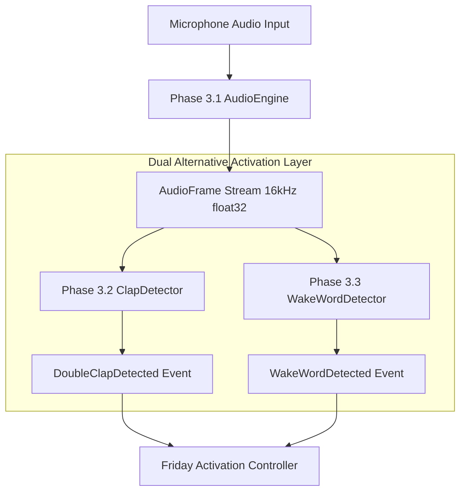

# Friday AI Assistant

## Project Overview

**Friday AI Assistant** is a fully local, high-performance personal AI desktop assistant designed specifically for Windows (Windows 11 primary, Windows 10 secondary). 

The assistant launches automatically on Windows boot, runs efficiently in the background with minimal memory and CPU usage, understands natural language, automates desktop tasks, and executes commands with sub-second latency.

---

## 🚦 Project Status & Roadmap

- [x] **Phase 1.1 – Project Foundation & Architecture** (Completed)
- [x] **Phase 1.2 – Desktop Application & UI Framework** (Completed)
- [x] **Phase 1.3 – Core System Services & OS Integration** (Completed)
- [x] **Phase 1.4 – Configuration, Logging, Diagnostics & Plugin Foundation** (Completed)
- [x] **Phase 1.5 – Windows Platform Integration & Production Readiness** (Completed)
- [x] **Phase 2.1 – Command & Tool Execution Foundation** (Completed)
- [x] **Phase 2.2 – Tool Executor & Execution Pipeline** (Completed)
- [x] **Phase 2.3 – Core Windows System Tools** (Completed)
- [x] **Phase 2.4 – Advanced Filesystem & Workspace Operations** (Completed)
- [x] **Phase 2.5 – Browser & Web Interaction Foundation** (Completed)
- [x] **Phase 2 Final Validation – System Integration, Security & Performance Audit** (Completed - **VERDICT: PASS**)
- [x] **Phase 3.1 – Audio Engine Foundation** (Completed - **VERDICT: PASS**)
- [x] **Phase 3.2 – Double-Clap Detection & Activation** (Completed - **VERDICT: PASS**)
- [x] **Phase 3.3 – Wake Word Detection & Voice Activation** (Completed - **VERDICT: PASS**)
- [x] **Phase 3.4 – Voice Activity Detection & Speech Boundary Engine** (Completed - **VERDICT: PASS**)
- [x] **Phase 3.5 – Faster-Whisper Speech-to-Text Engine** (Completed - **VERDICT: PASS**)
- [x] **Phase 3.6 – Piper Text-to-Speech Engine** (Completed - **VERDICT: PASS**)
- [x] **Phase 3.7 – Conversation State Machine** (Completed - **VERDICT: PASS**)
- [x] **Phase 3.8 – Conversation Orchestrator & Manager** (Completed - **VERDICT: PASS**)
- [x] **Phase 3.9 – Natural Greetings Foundation** (Completed - **VERDICT: PASS**)
- [x] **Phase 4.1 – Local LLM Runtime Engine** (Completed - **VERDICT: PASS**)
- [x] **Phase 4.2 – Local AI Orchestrator & Multi-Step Execution** (Completed - **VERDICT: PASS**)
- [x] **Phase 4.3 – Tool Calling & Function Binding Engine** (Completed - **VERDICT: PASS**)
- [x] **Phase 4.4 – Personality Engine & Behavioral Identity System** (Completed - **VERDICT: PASS**)
- [x] **Phase 4.5 – Dynamic Response Generation Engine** (Completed - **VERDICT: PASS**)
- [x] **Phase 4.6 – Contextual Greetings & Intelligent Activation Responses** (Completed - **VERDICT: PASS**)
- [x] **Phase 4.7 – Conversational Continuity & Context-Aware AI Dialogue** (Completed - **VERDICT: PASS**)
- [x] **Phase 5.1 – Short-Term Memory Foundation & Active Conversation Memory** (Completed - **VERDICT: PASS**)
- [x] **Phase 5.2 – Session Memory & Active Session Context Management** (Completed - **VERDICT: PASS**)
- [x] **Phase 5.3 – Long-Term Memory & Persistent Memory Foundation** (Completed - **VERDICT: PASS**)
- [x] **Phase 5.4 – User Profile & Personal Context Management** (Completed - **VERDICT: PASS**)
- [x] **Phase 5.5 – Semantic Memory & Local Vector Index Foundation** (Completed - **VERDICT: PASS**)

---

## 🛠️ Technology Stack

| Technology | Purpose | Where Used | Future Usage |
| :--- | :--- | :--- | :--- |
| **Python 3.12+** | Core Programming Language | Entire Application | Core runtime across all phases |
| **PySide6 (Qt6)** | Desktop GUI Framework & Clipboard | `app/ui/`, `clipboard_tools.py` | Native controls, widgets, & clipboard operations |
| **sounddevice (v0.5.5)** | Real-Time Audio Capture & Playback | `app/voice/audio/` | Hardware device enumeration, microphone streaming & speaker output |
| **Local DSP & NumPy** | Clap Signal Processing & Noise Floor | `app/voice/clap/` | Transient attack detection, energy ratio, adaptive noise floor tracking |
| **dependency-injector** | Dependency Injection Container | `app/dependency/` | Decoupling services, repositories, tools, executors & AI providers |
| **Pydantic v2** | Schema Validation & Tool Schemas | `app/tools/`, `app/config/`, `app/voice/` | Tool schemas, Command models, AudioFrames & Clap events |
| **Playwright (sync_api)** | Local Desktop Browser Automation | `app/platform/browser/` | PlaywrightController persistent context & tab session management |
| **pywin32 / winreg / ctypes** | Windows APIs, Windows Controls & Shell | `app/platform/`, `filesystem_service.py` | Native window management, audio endpoints, Recycle Bin `SHFileOperationW` |
| **psutil** | Process Management & Hardware Metrics | `app/monitoring/`, `process_tools.py` | CPU, RAM, Disk, Uptime, Process listing, & PID control |
| **APScheduler** | Background Job Scheduler | `app/services/scheduler/` | Foundation for interval, cron, & delayed tasks |
| **Loguru** | Centralized Multi-Channel Logging | `app/logging/` | Rotating log sinks (`application`, `errors`, `performance`, `plugins`, `crash`) |
| **Pytest** | Automated, Integration & Security Testing | `tests/`, `tests/smoke/` | Full automated test suite (144 unit, integration, stress & audio/clap tests) |
| **Black & Ruff** | Formatting & Linting | Codebase-wide | Quality enforcement & static analysis |

---

## 👏 Phase 3.2 Double-Clap CLI Diagnostics

Friday includes developer CLI diagnostic commands to verify Clap Detector status, noise floor estimation, timing state machine, and interactive double-clap activation testing:

```bash
# 1. Print Clap Detector health status, state machine state, noise floor, and metrics
python main.py --clap-health-check

# 2. Run interactive double-clap microphone activation test (5s capture + live event feedback)
python main.py --clap-test
```

---

## 🤖 Local AI Brain, Personality & Conversational Continuity CLI Diagnostics

Friday includes developer CLI diagnostic commands to verify the Local LLM Runtime, AI Orchestrator reasoning workflow, Tool Calling Engine, Personality Engine, Dynamic Response Generator, Contextual AI Greetings, and Conversational Continuity:

```bash
# 1. Print Local LLM Runtime health report and metrics
python main.py --llm-health-check

# 2. Run Local LLM prompt generation inference test
python main.py --llm-test

# 3. Run Local LLM model load time and token throughput benchmark
python main.py --llm-benchmark

# 4. Print AI Orchestrator health report and reasoning metrics
python main.py --orchestrator-health-check

# 5. Run simulated AI Orchestrator workflow and tool execution test
python main.py --orchestrator-test

# 6. Print Tool Calling Engine health report and metrics
python main.py --tool-calling-health-check

# 7. Run Tool Definition JSON Schema generation test
python main.py --tool-schema-test

# 8. Run Tool Calling execution lifecycle test
python main.py --tool-calling-test

# 9. Run Tool Calling Security & Sanitization audit test
python main.py --tool-call-security-test

# 10. Print Personality Engine health report and metrics
python main.py --personality-health-check

# 11. Run Personality profile and behavioral rules test
python main.py --personality-test

# 12. Run Personality compact prompt snippet generation test
python main.py --personality-context-test

# 13. Run Personality dynamic context modifiers test
python main.py --personality-modifier-test

# 14. Print Response Generator health report and metrics
python main.py --response-health-check

# 15. Run Dynamic Response Generation end-to-end turn test
python main.py --response-test

# 16. Run Response Generator fact-grounded context assembly test
python main.py --response-context-test

# 17. Run Response Generator factual grounding test
python main.py --response-grounding-test

# 18. Run Response Generator deterministic fallback test
python main.py --response-fallback-test

# 19. Run Contextual AI Greeting generation test
python main.py --greeting-ai-test

# 20. Run Greeting context assembly test
python main.py --greeting-context-test

# 21. Run Greeting template fallback test
python main.py --greeting-fallback-test

# 22. Run Greeting repetition prevention test
python main.py --greeting-repetition-test

# 23. Print Conversational Continuity health report and metrics
python main.py --conversation-continuity-health-check

# 24. Run Conversational Continuity turn test
python main.py --conversation-continuity-test

# 25. Run Pending Clarification lifecycle test
python main.py --clarification-test

# 26. Run Reference resolution test
python main.py --reference-resolution-test

# 27. Run User intent/entity correction test
python main.py --conversation-correction-test

# 28. Run Operation retry test
python main.py --conversation-retry-test

# 29. Run ContextSnapshot build test
python main.py --conversation-context-test

# 30. Run Bounded context stress test
python main.py --conversation-stress-test

# 31. Print Conversation State Machine health report and metrics
python main.py --conversation-health-check

# 32. Print Conversation Manager health report and context metrics
python main.py --conversation-manager-health-check

# 33. Print Natural Greetings Service health report and metrics
python main.py --greeting-health-check
```

---

## 📋 Available Core System Tools Inventory (75 Registered Tools)

| Tool ID | Display Name | Category | Risk | Required Permissions | Confirmation | Idempotent |
| :--- | :--- | :--- | :--- | :--- | :--- | :--- |
| `system.echo` | Echo Message Tool | `SYSTEM` | `LOW` | None | False | True |
| `system.get_application_info` | Get Application Info | `SYSTEM` | `LOW` | None | False | True |
| `system.get_runtime_status` | Get Runtime Status | `SYSTEM` | `LOW` | None | False | True |
| `system.get_cpu_info` | Get CPU Information | `SYSTEM` | `LOW` | `process.read` | False | True |
| `system.get_memory_info` | Get Memory Information | `SYSTEM` | `LOW` | `process.read` | False | True |
| `system.get_disk_info` | Get Disk Information | `SYSTEM` | `LOW` | `filesystem.read` | False | True |
| `system.get_windows_info` | Get Windows Info | `WINDOWS` | `LOW` | None | False | True |
| `system.get_uptime` | Get System Uptime | `SYSTEM` | `LOW` | None | False | True |
| `system.get_current_user` | Get Current User | `SYSTEM` | `LOW` | None | False | True |
| `system.open_application` | Open Application | `WINDOWS` | `LOW` | `process.control` | False | False |
| `system.close_application` | Close Application | `WINDOWS` | `MEDIUM` | `process.control` | False | False |
| `system.application_status` | Application Status | `WINDOWS` | `LOW` | `process.read` | False | True |
| `files.open_file` | Open File | `FILES` | `LOW` | `filesystem.read` | False | False |
| `files.open_folder` | Open Folder | `FILES` | `LOW` | `filesystem.read` | False | False |
| `files.file_exists` | Check File Exists | `FILES` | `LOW` | `filesystem.read` | False | True |
| `files.folder_exists` | Check Folder Exists | `FILES` | `LOW` | `filesystem.read` | False | True |
| `files.get_file_info` | Get File Metadata | `FILES` | `LOW` | `filesystem.read` | False | True |
| `files.get_folder_info` | Get Folder Metadata | `FILES` | `LOW` | `filesystem.read` | False | True |
| `files.create_file` | Create File | `FILES` | `MEDIUM` | `filesystem.create` | False | False |
| `files.create_folder` | Create Folder | `FILES` | `MEDIUM` | `filesystem.create` | False | True |
| `files.copy_file` | Copy File | `FILES` | `MEDIUM` | `filesystem.copy` | False | False |
| `files.copy_folder` | Copy Folder | `FILES` | `MEDIUM` | `filesystem.copy` | False | False |
| `files.list_directory` | List Directory Contents | `FILES` | `LOW` | `filesystem.read` | False | True |
| `files.calculate_size` | Calculate Size | `FILES` | `LOW` | `filesystem.read` | False | True |
| `files.move_file` | Move File | `FILES` | `HIGH` | `filesystem.move` | **True** | False |
| `files.move_folder` | Move Folder | `FILES` | `HIGH` | `filesystem.move` | **True** | False |
| `files.rename_file` | Rename File | `FILES` | `MEDIUM` | `filesystem.rename` | False | False |
| `files.rename_folder` | Rename Folder | `FILES` | `MEDIUM` | `filesystem.rename` | False | False |
| `files.delete_file` | Delete File | `FILES` | `HIGH` | `filesystem.delete` | **True** | False |
| `files.delete_folder` | Delete Folder | `FILES` | `CRITICAL` | `filesystem.delete` | **True** | False |
| `files.search` | Search Files | `FILES` | `LOW` | `filesystem.search` | False | True |
| `files.hash_file` | Hash File | `FILES` | `LOW` | `filesystem.read` | False | True |
| `files.compare` | Compare Files | `FILES` | `LOW` | `filesystem.read` | False | True |
| `files.workspace_info` | Get Workspace Info | `FILES` | `LOW` | `filesystem.read` | False | True |
| `files.recent` | Get Recent Files | `FILES` | `LOW` | `filesystem.read` | False | True |
| `files.batch_operation` | Batch File Operation | `FILES` | `HIGH` | `filesystem.write` | **True** | False |
| `browser.open` | Open Browser | `MEDIA` | `LOW` | `browser.navigate` | False | True |
| `browser.open_url` | Open Web URL | `MEDIA` | `MEDIUM` | `browser.navigate` | False | False |
| `browser.status` | Get Browser Status | `MEDIA` | `LOW` | `browser.read` | False | True |
| `browser.current_page` | Get Current Page | `MEDIA` | `LOW` | `browser.read` | False | True |
| `browser.get_title` | Get Page Title | `MEDIA` | `LOW` | `browser.read` | False | True |
| `browser.get_page_text` | Get Page Text | `MEDIA` | `LOW` | `browser.read` | False | True |
| `browser.get_page_info` | Get Page Info | `MEDIA` | `LOW` | `browser.read` | False | True |
| `browser.get_links` | Get Web Links | `MEDIA` | `LOW` | `browser.read` | False | True |
| `browser.list_tabs` | List Browser Tabs | `MEDIA` | `LOW` | `browser.tabs` | False | True |
| `browser.active_tab` | Get Active Tab | `MEDIA` | `LOW` | `browser.tabs` | False | True |
| `browser.new_tab` | New Tab | `MEDIA` | `MEDIUM` | `browser.tabs` | False | False |

---

## 🎙️ Phase 3 Voice Engine Subsystems

### Phase 3.1 — Audio Engine Foundation
- 16,000 Hz float32 PCM ring buffer audio stream (`AudioEngine`, `InputStream`, `OutputStream`).
- Hardware input/output device discovery, selection, and health diagnostics.
- Synthetic 440 Hz test tone generation and real-time C-callback safety (< 1ms target).

### Phase 3.2 — Double-Clap Gesture Activation
- Transient impulse signal processing (crest factor > 2.5, peak amplitude > 0.15, transient duration 5ms–60ms).
- Dynamic noise floor tracking and double-clap timing window state machine (150ms–1000ms interval, 2000ms cooldown).

### Phase 3.3 — Wake Word Detection & Voice Activation
- 100% local OpenWakeWord ONNX inference engine (`WakeWordDetector`, `WakeWordModelProvider`, `WakeWordAudioAdapter`).
- Continuous confidence score evaluation against configurable threshold (default: 0.70) with refractory cooldown (default: 2000ms).
- Dual alternative activation model emitting `WakeWordDetected` events on `EventBus`.



---

## 🧠 Phase 5.1 Short-Term Memory Subsystem & CLI Commands

Friday includes dedicated CLI verification commands for Phase 5.1 Short-Term Memory:

```bash
# Run Short-Term Memory diagnostic health report
python main.py --memory-health-check

# Run interactive pronoun & entity memory resolution test ("Chrome" -> "it", "Edge" -> "it")
python main.py --memory-test

# Run 1,000 entry stress test verifying memory bounds and eviction
python main.py --memory-stress-test

# Run read-only snapshot immutability test
python main.py --memory-snapshot-test

# Run session reset isolation test (Session A vs Session B)
python main.py --memory-session-reset-test
```

---

## 🧠 Phase 5.2 Session Memory Subsystem & CLI Commands

Friday includes dedicated CLI verification commands for Phase 5.2 Session Memory:

```bash
# Run Session Memory diagnostic health report
python main.py --session-memory-health-check

# Run interactive multi-turn session workflow test ("Open Chrome" -> "Search AI news" -> "Open first result" -> "Summarize it")
python main.py --session-memory-test

# Run session active task creation, update, and clear test
python main.py --session-task-test

# Run temporary session-only preference isolation test
python main.py --session-preference-test

# Run session reset and cross-session isolation test
python main.py --session-reset-test

# Run session memory stress test (100 topic/task/workflow simulation)
python main.py --session-memory-stress-test
```

---

## 💾 Phase 5.3 Long-Term Memory Subsystem & CLI Commands

Friday includes dedicated CLI verification commands for Phase 5.3 Long-Term Persistent Memory:

```bash
# Run Long-Term Memory diagnostic health report
python main.py --long-term-memory-health-check

# Run basic CRUD operations test on SQLite persistent store
python main.py --long-term-memory-test

# Run process restart persistence test (Process A writes memory -> Process B verifies retrieval)
python main.py --long-term-memory-persistence-test

# Run candidate memory promotion test from Session Memory
python main.py --memory-promotion-test

# Run memory deduplication prevention test
python main.py --memory-dedup-test

# Run memory preference conflict resolution test (Chrome -> Edge update)
python main.py --memory-conflict-test

# Run explicit memory forget/deactivation test
python main.py --memory-forget-test

# Run memory clear test
python main.py --memory-clear-test

# Run SQLite database failure recovery test
python main.py --memory-database-failure-test

# Run secret credential rejection security test
python main.py --long-term-memory-security-test
```

---

## 👤 Phase 5.4 User Profile Subsystem & CLI Commands

Friday includes dedicated CLI verification commands for Phase 5.4 User Profile & Personal Context Management:

```bash
# Run User Profile diagnostic health report
python main.py --user-profile-health-check

# Run User Profile read & build test from persistent long-term memory
python main.py --user-profile-test

# Run profile preference updates & superseding test (Chrome -> Edge update)
python main.py --profile-preference-test

# Run persistent project profile test
python main.py --profile-project-test

# Run explicit contact memory test (with zero background scraping protection)
python main.py --profile-contact-test

# Run recurring workflow profile storage test
python main.py --profile-workflow-test

# Run prompt-ready UserProfileSnapshot generation test
python main.py --profile-snapshot-test

# Run profile preference reset test
python main.py --profile-reset-test
```

---

## 🔍 Phase 5.5 Semantic Memory & Local Vector Index CLI Commands

Friday includes dedicated CLI verification commands for Phase 5.5 Semantic Memory & Local Vector Index Foundation:

```bash
# Run Semantic Memory diagnostic health report
python main.py --semantic-memory-health-check

# Run local vector embedding provider test
python main.py --embedding-test

# Run low-level semantic vector search query test
python main.py --semantic-memory-test

# Run batch embedding & FAISS throughput benchmark
python main.py --semantic-memory-benchmark

# Run atomic FAISS index rebuild test from SQLite
python main.py --semantic-memory-rebuild-test

# Run vector vs SQLite metadata consistency test
python main.py --semantic-memory-consistency-test

# Run embedding model change detection test
python main.py --semantic-memory-model-change-test

# Run index corruption failure recovery test
python main.py --semantic-memory-failure-test
```

---

## 🎯 Phase 5.6 Memory Retrieval & Relevant Context Engine CLI Commands

Friday includes dedicated CLI verification commands for Phase 5.6 Memory Retrieval Subsystem:

```bash
# Run Memory Retrieval diagnostic health report
python main.py --memory-retrieval-health-check

# Run basic memory retrieval test
python main.py --memory-retrieval-test

# Run profile preference retrieval test
python main.py --memory-retrieval-profile-test

# Run session instruction priority override test
python main.py --memory-retrieval-session-priority-test

# Run relevance candidate filtering test
python main.py --memory-retrieval-filter-test

# Run empty retrieval test (zero hallucination)
python main.py --memory-retrieval-empty-test

# Run semantic query variation retrieval test
python main.py --memory-retrieval-semantic-test

# Run explicit memory question retrieval test
python main.py --memory-retrieval-explicit-test

# Run system action policy skip test
python main.py --memory-retrieval-skip-test

# Run multi-factor ranking score test
python main.py --memory-retrieval-ranking-test

# Run context budgeting and formatting test
python main.py --memory-retrieval-context-test

# Run degraded offline structured fallback test
python main.py --memory-retrieval-degraded-test

# Run prompt injection isolation and secret masking test
python main.py --memory-retrieval-security-test
```

---

## 🛡️ Phase 5.7 Memory Privacy, Security, Governance & User Control CLI Commands

Friday includes dedicated CLI verification commands for Phase 5.7 Memory Privacy Governance Subsystem:

```bash
# Run Memory Privacy diagnostic health report
python main.py --memory-privacy-health-check

# Run privacy policy write evaluation & secret defense test
python main.py --memory-privacy-test

# Run end-to-end privacy deletion propagation test
python main.py --memory-privacy-delete-test

# Run retention expiration cleanup test
python main.py --memory-retention-test

# Run NO_PERSISTENCE privacy mode block test
python main.py --memory-no-persistence-test

# Run STRICT privacy confirmation requirement test
python main.py --memory-strict-privacy-test

# Run retrieval privacy evaluation test
python main.py --memory-retrieval-privacy-test

# Run vector indexing privacy evaluation test
python main.py --memory-index-privacy-test

# Run profile visibility privacy evaluation test
python main.py --memory-profile-privacy-test

# Run complete memory wipe test with explicit confirmation
python main.py --memory-clear-all-privacy-test

# Run memory privacy reconciliation test
python main.py --memory-privacy-reconcile-test
```

---

## 🖥️ Phase 6.1 UI Automation Foundation & Element Tree Explorer CLI Commands

Friday includes dedicated CLI verification commands for Phase 6.1 UI Automation Foundation Subsystem:

```bash
# Run UI Automation diagnostic health report
python main.py --uia-health-check

# Inspect top-level window metadata and top-level children
python main.py --uia-inspect-window [--uia-title "Title"] [--uia-pid PID] [--uia-hwnd HWND]

# Dump UI element hierarchy tree (supports string formatted output or JSON)
# Run basic CRUD operations test on SQLite persistent store
python main.py --long-term-memory-test

# Run process restart persistence test (Process A writes memory -> Process B verifies retrieval)
python main.py --long-term-memory-persistence-test

# Run candidate memory promotion test from Session Memory
python main.py --memory-promotion-test

# Run memory deduplication prevention test
python main.py --memory-dedup-test

# Run memory preference conflict resolution test (Chrome -> Edge update)
python main.py --memory-conflict-test

# Run explicit memory forget/deactivation test
python main.py --memory-forget-test

# Run memory clear test
python main.py --memory-clear-test

# Run SQLite database failure recovery test
python main.py --memory-database-failure-test

# Run secret credential rejection security test
python main.py --long-term-memory-security-test
```

---

## 👤 Phase 5.4 User Profile Subsystem & CLI Commands

Friday includes dedicated CLI verification commands for Phase 5.4 User Profile & Personal Context Management:

```bash
# Run User Profile diagnostic health report
python main.py --user-profile-health-check

# Run User Profile read & build test from persistent long-term memory
python main.py --user-profile-test

# Run profile preference updates & superseding test (Chrome -> Edge update)
python main.py --profile-preference-test

# Run persistent project profile test
python main.py --profile-project-test

# Run explicit contact memory test (with zero background scraping protection)
python main.py --profile-contact-test

# Run recurring workflow profile storage test
python main.py --profile-workflow-test

# Run prompt-ready UserProfileSnapshot generation test
python main.py --profile-snapshot-test

# Run profile preference reset test
python main.py --profile-reset-test
```

---

## 🔍 Phase 5.5 Semantic Memory & Local Vector Index CLI Commands

Friday includes dedicated CLI verification commands for Phase 5.5 Semantic Memory & Local Vector Index Foundation:

```bash
# Run Semantic Memory diagnostic health report
python main.py --semantic-memory-health-check

# Run local vector embedding provider test
python main.py --embedding-test

# Run low-level semantic vector search query test
python main.py --semantic-memory-test

# Run batch embedding & FAISS throughput benchmark
python main.py --semantic-memory-benchmark

# Run atomic FAISS index rebuild test from SQLite
python main.py --semantic-memory-rebuild-test

# Run vector vs SQLite metadata consistency test
python main.py --semantic-memory-consistency-test

# Run embedding model change detection test
python main.py --semantic-memory-model-change-test

# Run index corruption failure recovery test
python main.py --semantic-memory-failure-test
```

---

## 🎯 Phase 5.6 Memory Retrieval & Relevant Context Engine CLI Commands

Friday includes dedicated CLI verification commands for Phase 5.6 Memory Retrieval Subsystem:

```bash
# Run Memory Retrieval diagnostic health report
python main.py --memory-retrieval-health-check

# Run basic memory retrieval test
python main.py --memory-retrieval-test

# Run profile preference retrieval test
python main.py --memory-retrieval-profile-test

# Run session instruction priority override test
python main.py --memory-retrieval-session-priority-test

# Run relevance candidate filtering test
python main.py --memory-retrieval-filter-test

# Run empty retrieval test (zero hallucination)
python main.py --memory-retrieval-empty-test

# Run semantic query variation retrieval test
python main.py --memory-retrieval-semantic-test

# Run explicit memory question retrieval test
python main.py --memory-retrieval-explicit-test

# Run system action policy skip test
python main.py --memory-retrieval-skip-test

# Run multi-factor ranking score test
python main.py --memory-retrieval-ranking-test

# Run context budgeting and formatting test
python main.py --memory-retrieval-context-test

# Run degraded offline structured fallback test
python main.py --memory-retrieval-degraded-test

# Run prompt injection isolation and secret masking test
python main.py --memory-retrieval-security-test
```

---

## 🛡️ Phase 5.7 Memory Privacy, Security, Governance & User Control CLI Commands

Friday includes dedicated CLI verification commands for Phase 5.7 Memory Privacy Governance Subsystem:

```bash
# Run Memory Privacy diagnostic health report
python main.py --memory-privacy-health-check

# Run privacy policy write evaluation & secret defense test
python main.py --memory-privacy-test

# Run end-to-end privacy deletion propagation test
python main.py --memory-privacy-delete-test

# Run retention expiration cleanup test
python main.py --memory-retention-test

# Run NO_PERSISTENCE privacy mode block test
python main.py --memory-no-persistence-test

# Run STRICT privacy confirmation requirement test
python main.py --memory-strict-privacy-test

# Run retrieval privacy evaluation test
python main.py --memory-retrieval-privacy-test

# Run vector indexing privacy evaluation test
python main.py --memory-index-privacy-test

# Run profile visibility privacy evaluation test
python main.py --memory-profile-privacy-test

# Run complete memory wipe test with explicit confirmation
python main.py --memory-clear-all-privacy-test

# Run memory privacy reconciliation test
python main.py --memory-privacy-reconcile-test
```

---

## 🖥️ Phase 6.1 UI Automation Foundation & Element Tree Explorer CLI Commands

Friday includes dedicated CLI verification commands for Phase 6.1 UI Automation Foundation Subsystem:

```bash
# Run UI Automation diagnostic health report
python main.py --uia-health-check

# Inspect top-level window metadata and top-level children
python main.py --uia-inspect-window [--uia-title "Title"] [--uia-pid PID] [--uia-hwnd HWND]

# Dump UI element hierarchy tree (supports string formatted output or JSON)
python main.py --uia-tree-dump [--uia-title "Title"] [--uia-process-name "chrome.exe"] [--uia-max-depth 5] [--uia-json]

# Search for UI elements using structured locator criteria
python main.py --uia-find-element [--uia-name "Save"] [--uia-control-type "Button"] [--uia-pid PID]

# Inspect supported UIA control patterns for top-level controls
python main.py --uia-pattern-test [--uia-title "Title"]
```

---

## 🖱️ Phase 6.2 Mouse, Keyboard & Human-Like Input Control Engine CLI Commands

Friday includes dedicated CLI verification commands for Phase 6.2 Input Control Subsystem:

```bash
# Run Input Engine diagnostic health report
python main.py --input-engine-health-check

# Run Input Engine dry-run test sequence (MoveTo, Click, KeyPress, Hotkey, Typing)
python main.py --input-test --dry-run

# Run drag-and-drop input dry-run test sequence
python main.py --drag-drop-test --dry-run

# Test physical user interruption monitor and state tracking
python main.py --input-interruption-test

# Test emergency top-left corner mouse failsafe
python main.py --input-failsafe-test

# Test task cancellation during active input operation
python main.py --input-cancel-test

# Execute REAL physical hardware input test (REQUIRES explicit --confirm-hardware-test flag)
python main.py --input-hardware-test --confirm-hardware-test
```

---

## 🪟 Phase 6.3 Window Management, Desktop Control, Clipboard & Screen Inspection CLI Commands

Friday includes dedicated CLI verification commands for Phase 6.3 Desktop Control Subsystem:

```bash
# Run Desktop Control diagnostic health report
python main.py --desktop-health-check

# Run top-level window discovery and active foreground window inspection test
python main.py --window-control-test

# Run high-performance in-memory screen capture test
python main.py --screenshot-test

# Run safe clipboard format inspection, secret masking, and safe read/write test
python main.py --clipboard-test

# Run workspace topology layout capture test
python main.py --workspace-test

# Run multi-monitor display bounds and work area inspection test
python main.py --monitor-test

# Run Windows virtual desktop status query test
python main.py --virtual-desktop-test
```

---

## 📱 Phase 6.4 Application Control & Interaction Adapters CLI Commands

Friday includes dedicated CLI verification commands for Phase 6.4 Application Control Subsystem:

```bash
# Run Phase 6.4 Application Adapter diagnostic health report
python main.py --application-adapter-health-check

# Run Application Adapter registry and alias resolution test
python main.py --application-adapter-test

# Run ApplicationLauncher executable resolution and dry-run test
python main.py --app-launcher-test

# Run ExplorerAdapter inspection dry-run test
python main.py --explorer-automation-test

# Run TerminalAdapter inspection dry-run test
python main.py --terminal-automation-test
```

---

## ⚡ Phase 6.5 Multi-Step Automation Workflow Engine CLI Commands

Friday includes dedicated CLI verification commands for Phase 6.5 Multi-Step Automation Workflow Engine:

```bash
# Run Phase 6.5 Workflow Engine diagnostic health report
python main.py --workflow-engine-health-check

# Run Workflow Engine step-by-step simulation test
python main.py --workflow-engine-test

# Run pre-defined declarative example workflows test (Explorer, Terminal, Workspace)
python main.py --workflow-example-test

# Run pre-flight plan validation dry-run test
python main.py --workflow-dry-run-test

# Run step failure policy test
python main.py --workflow-failure-test

# Run physical user interruption propagation test
python main.py --workflow-interruption-test

# Run emergency mouse failsafe propagation test
python main.py --workflow-failsafe-test

# Run CancellationToken cancellation test
python main.py --workflow-cancel-test

# Run StepVerifier condition evaluation test
python main.py --workflow-verification-test

# Run step recovery strategy execution test
python main.py --workflow-recovery-test

# Run security boundary and code injection protection test
python main.py --workflow-security-test

# Run single live execution resource locking test
python main.py --workflow-resource-test
```

---

## 🛠️ Phase 6.6 Automation Tool Suite & AI Orchestrator Integration CLI Commands

Friday includes dedicated CLI verification commands for Phase 6.6 Automation Tool Suite:

```bash
# Run Phase 6.6 Automation Tool Suite health diagnostic check
python main.py --automation-tools-health-check

# Run Phase 6.6 Automation Tool discovery and registry test
python main.py --automation-tools-test

# Run Phase 6.6 canonical ToolDefinition schema generation test
python main.py --automation-schema-test

# Run Phase 6.6 ToolExecutor permission and secret masking security test
python main.py --automation-tool-security-test

# Run ToolCallingEngine/AIOrchestrator automation tool integration test
python main.py --orchestrator-automation-test

# Run WorkflowExecuteSequenceTool execution test
python main.py --automation-workflow-tool-test

# Run Automation Tool CancellationToken interruption test
python main.py --automation-tool-interruption-test

# Run Automation Tool mouse failsafe corner protection test
python main.py --automation-tool-failsafe-test

# Run Terminal tool output isolation and credential masking test
python main.py --automation-terminal-security-test

# Run Screen capture and monitor topology tool test
python main.py --automation-screen-test

# Run Clipboard read/write tool test
python main.py --automation-clipboard-test

# Run Window list/focus/maximize/snap tool test
python main.py --automation-window-test

# Run Application launch/attach/status tool test
python main.py --automation-application-test
```

---

## 🛡️ Phase 6.7 Safety, Fail-Safe Guardrails, Privacy & Diagnostics CLI Commands

Friday includes dedicated CLI verification commands for Phase 6.7 Safety Governance:

```bash
# Run comprehensive Phase 6.1-6.7 computer automation health check
python main.py --automation-health-check

# Run Phase 6.7 security preflight, tool bypass rejection, and injection test
python main.py --automation-security-test

# Run Phase 6.7 top-left mouse failsafe corner trigger propagation test
python main.py --automation-failsafe-test

# Run Phase 6.7 physical user interruption propagation test
python main.py --automation-user-interrupt-test

# Run Phase 6.7 user confirmation request, expiration, and replay test
python main.py --automation-confirmation-test

# Run Phase 6.7 emergency stop kill switch trigger and reset test
python main.py --automation-killswitch-test

# Run Phase 6.7 blast radius limit bounds evaluation test
python main.py --automation-blast-radius-test

# Run Phase 6.7 action rate limit throttling evaluation test
python main.py --automation-rate-limit-test

# Run Phase 6.7 runaway loop detection and retry bound test
python main.py --automation-loop-protection-test

# Run Phase 6.7 desktop, terminal, clipboard, and UI privacy sanitization test
python main.py --automation-privacy-test

# Run Phase 6.7 bounded privacy-preserving audit log recorder test
python main.py --automation-audit-test

# Run Phase 6.7 LOCKDOWN mode automation rejection test
python main.py --automation-lockdown-test

# Run Phase 6.7 automation crash safety and cleanup test
python main.py --automation-crash-recovery-test

# Run Phase 6.7 named automation resource locking test
python main.py --automation-resource-test
```
