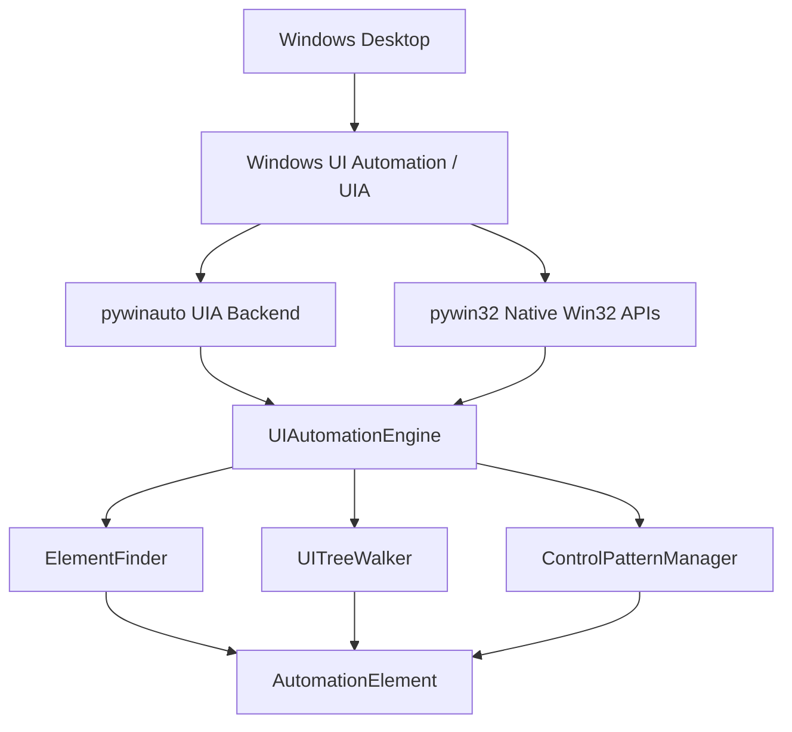

# Phase 6.1 Implementation Report — UI Automation Foundation & Element Tree Explorer

## 1. Executive Summary

Phase 6.1 establishes the foundational Windows UI Automation (UIA) subsystem for Friday AI Assistant, giving Friday a reliable semantic understanding of Windows graphical user interface elements. This phase implements inspection, window resolution, tree traversal, semantic element finding, and safe low-level UIA control pattern operations without performing physical computer control, coordinate-based automation, or exposing tools directly to the AI orchestrator.

## 2. Architecture & Design Principles

- **UIA-First Hierarchy**: 1. Windows UIA -> 2. Native Win32 APIs (`pywin32`) -> 3. Input engine (Phase 6.2+) -> 4. Coordinate fallback (Phase 6.3+).
- **Windows Native Only**: Explicitly bounded to Windows operating systems (`sys.platform == "win32"`), using native HWNDs, PIDs, and UIA control types.
- **Read-Only / Non-Invasive Startup**: Startup sequence is inspection-only. Friday initializes UIA safely without manipulating windows, moving the mouse, or typing text.
- **Strict Phase Boundary**: Zero mouse/keyboard simulation, no PyAutoGUI, no screenshot captures, no OCR, no AI tool registrations in Phase 6.1.

## 3. Core Components Implemented

### 3.1 Domain Models & Error Hierarchy (`app/automation/models.py`, `app/automation/errors.py`)
- `AutomationElement`: Domain object representing UI controls (element_id, name, automation_id, control_type, class_name, process_id, window_handle, bounding_rectangle, is_enabled, is_visible, is_offscreen, framework_id, supported_patterns, value, is_password, has_keyboard_focus, etc.).
- `AutomationElementSnapshot`: Read-only, serializable snapshot model suitable for CLI, diagnostics, and testing.
- `AutomationTreeNode`: Machine-readable serializable tree representation with depth, children, and truncation status.
- `ElementSearchResult`: Structured search result (`FOUND`, `NOT_FOUND`, `AMBIGUOUS`, `LIMIT_REACHED`, `ERROR`) with matched elements and query diagnostics.
- `WindowSearchResult`: Top-level window search result with candidate metadata.
- `MatchMode` (Enum): `EXACT`, `CASE_INSENSITIVE`, `CONTAINS`, `STARTS_WITH`.
- Normalized control types: `Window`, `Button`, `Edit`, `Text`, `CheckBox`, `RadioButton`, `ComboBox`, `List`, `ListItem`, `Menu`, `MenuItem`, `Tab`, `TabItem`, `Tree`, `TreeItem`, `DataGrid`, `DataItem`, `Slider`, `ProgressBar`, `ScrollBar`, `ToolBar`, `StatusBar`, `Image`, `Hyperlink`, `Document`, `Pane`, `Group`.

### 3.2 Window Resolver (`app/automation/uia/window_resolver.py`)
- Discovers top-level application windows using `pywin32` (`EnumWindows`, `GetWindowText`, `GetClassName`, `GetWindowThreadProcessId`) and `psutil`.
- Attach methods: `attach_to_window(hwnd)`, `attach_to_process(pid)`, `attach_by_title(title)`, `attach_by_process_name(name)`.
- Ambiguity Protection: Returns `AMBIGUOUS` with full candidate list when multiple windows match.
- Process Exit Validation: Detects terminated processes and raises `ProcessExitedError`.

### 3.3 UI Automation Engine (`app/automation/uia/uia_engine.py`)
- `IUIAutomationEngine` interface & `UIAutomationEngine` service.
- Manages `pywinauto` UIA backend initialization.
- Wraps native HWNDs into domain `AutomationElement` instances.
- Handles password/secure fields by setting `is_password=True` and value=`[REDACTED]`.
- Converts COM/pywinauto exceptions to domain exceptions (`ElementStaleError`, `ElementNotFoundError`, `ProcessExitedError`).

### 3.4 UI Tree Walker (`app/automation/uia/tree_walker.py`)
- Traverses UI tree (`root`, `children`, `descendants`, `parent`).
- Enforces configurable bounds: `max_depth` (default 10), `max_nodes` (default 500), `max_children_per_node` (default 50).
- Implements identity signature visited set to protect against UI tree cycles and duplicate references.
- Outputs human-readable string dumps and machine-readable JSON structures with truncation flags.

### 3.5 Semantic Element Finder (`app/automation/uia/element_finder.py`)
- `IElementFinder` & `ElementFinder`.
- Lookup methods: `find_by_name()`, `find_by_automation_id()`, `find_by_control_type()`, `find_by_properties()`, `find_descendant()`, `find_children()`.
- Evaluates combined selectors and string match modes (`EXACT`, `CASE_INSENSITIVE`, `CONTAINS`, `STARTS_WITH`).
- Returns `ElementSearchResult` with ambiguity detection when multiple elements match.

### 3.6 Control Patterns & Safe Actions (`app/automation/uia/control_patterns.py`)
- Discovers supported patterns (`InvokePattern`, `ValuePattern`, `TogglePattern`, `SelectionItemPattern`, `ExpandCollapsePattern`, `ScrollPattern`, `RangeValuePattern`, `TextPattern`, `WindowPattern`).
- Low-level safe UIA actions: `invoke()`, `get_value()`, `set_value()`, `toggle()`, `select()`, `expand()`, `collapse()`.
- Validates element validity, enabled state, and pattern support. Converts raw errors into `ElementStaleError`, `PatternNotSupportedError`, or `ElementInvalidError`.

### 3.7 Metrics & Diagnostics (`app/automation/uia/metrics.py`, `app/automation/uia/diagnostics.py`)
- `UIAutomationMetrics`: Tracks initializations, enumerations, searches, ambiguities, traversals, truncations, pattern actions, stale element errors, process exit errors, and latencies.
- `UIAutomationDiagnostics`: Generates structured system status reports (`HEALTHY`, `DEGRADED`, `UNAVAILABLE`) without leaking sensitive UI text.

## 4. Security & Privacy Safeguards

1. **Authorization Boundary Preserved**: UIA engine is an internal foundation subsystem. It is **not** registered with `ToolRegistry` or exposed directly to the AI Orchestrator.
2. **Password Field Protection**: Automatic detection of UIA password controls (`IsPassword` flag or password class names) masks values as `[REDACTED]`.
3. **Sensitive UI Data Sanitization**: Diagnostic tree dumps sanitize password fields and enforce configurable privacy redaction (`diagnostic_redaction: bool = True`).
4. **Local-Only Operation**: All window enumeration and element inspection is strictly local to the Windows host. Zero cloud UI analysis or remote telemetry.

## 5. Configuration & DI Wiring

- Settings added under `automation.uia` in `app/config/models.py`:
  - `enabled: bool = True`
  - `max_tree_depth: int = 10`
  - `max_tree_nodes: int = 500`
  - `max_children: int = 50`
  - `default_match_mode: str = "EXACT"`
  - `include_offscreen: bool = False`
  - `include_disabled: bool = False`
  - `diagnostic_redaction: bool = True`
- Singletons registered in `ApplicationContainer` (`app/dependency/container.py`): `window_resolver`, `ui_automation_metrics`, `ui_tree_walker`, `ui_element_finder`, `ui_automation_diagnostics`, `ui_automation_engine`.

## 6. CLI Diagnostic Commands

- `python main.py --uia-health-check`: Subsystem health status report
- `python main.py --uia-inspect-window`: Inspect window candidates and top-level children
- `python main.py --uia-tree-dump`: Display formatted UI element hierarchy (supports `--uia-json`)
- `python main.py --uia-find-element`: Search elements using structured criteria
- `python main.py --uia-pattern-test`: Inspect supported control patterns for top-level elements

## 7. Deferred Phase 6 Subphases

- **Phase 6.2**: Mouse & Keyboard Human-Like Input Control Engine (PyAutoGUI, SendInput)
- **Phase 6.3**: Window Management, Desktop Control, Clipboard & Screen Inspection
- **Phase 6.4**: Application Control & Interaction Adapters (Explorer, Terminal)
- **Phase 6.5**: Multi-Step Automation Workflow Engine
- **Phase 6.6**: Automation Tool Suite & AI Orchestrator Integration
- **Phase 6.7**: Security, Fail-Safe Guardrails, Privacy & Comprehensive Diagnostics
